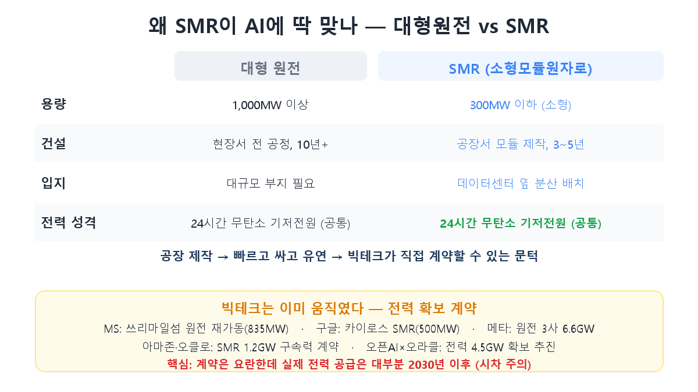
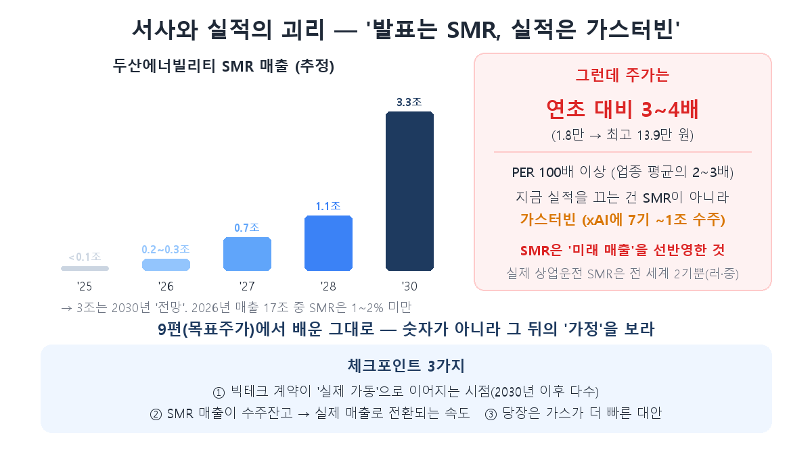

2024年、マイクロソフトが世界を驚かせる契約を結びました。1979年に米国最悪の原発事故が起きたまさにその場所、**スリーマイル島原発を蘇らせて**AIデータセンターに電気を供給する、というのです。20年分の電力を丸ごと買う条件でした。死んだ原発がAIのために復活したこの場面が、いま起きている「原発ルネサンス」の象徴です。

[第1回](/ja/p/ai-power-hunger/)で、AI電力難のお金は発電・送配・冷却の3方向に流れると述べました。今日はその中で最も熱い**発電**——特に原発、なかでも**SMR（小型モジュール炉）**がなぜ急にAI受益株になったのかを見ます。ただ結論から言えば、このテーマは魅力と落とし穴が共存します。両方とも正直に押さえます。

## なぜ原発なのか — AIが求める電気の条件

AIデータセンターが求める電気には厳しい条件があります。**24時間途切れず、大量で、できれば無炭素**の電気。太陽光・風力は日が沈み風が止めば途切れる（間欠性）ためデータセンターの24時間稼働と合いません。その条件を満たすのが原子力です。だから一時は斜陽産業扱いされた原発が、AIのおかげで華々しく復帰したのです。

ここでSMRが登場します。従来の大型原発と何が違うか見ましょう。

大型原発は1,000MW以上の大容量ですが、敷地で全工程を建設し**10年以上**かかり、大規模な土地が必要です。一方SMRは300MW以下の小さな原子炉を**工場でモジュールとして製造し**現場で組み立てる方式で、建設が3～5年と短く、データセンターの隣に分散配置できます。レゴブロックのように標準化された原発を必要なだけ付け足す発想です。速く、比較的安く、柔軟——だからビッグテックが直接契約できる水準まで敷居が下がったのです。

実際ビッグテックはすでに動いています。MSのスリーマイル島（835MW）、Google-Kairos SMR（500MW）、Metaの原発3社6.6GW、Amazon-Oklo SMR 1.2GW、OpenAI-Oracleの4.5GW確保推進まで。AI時代の電気確保競争が原発に飛び火したのです。

## 韓国は「原発ファウンドリー」で走る

半導体シリーズでTSMCを「他人の設計図でチップを作るファウンドリー」と呼びました（第5回）。原発にも同じ構図が生まれました。米国のSMR設計会社（NuScale・X-energy・TerraPower）が設計をすると、その原子炉の中核部品（圧力容器・蒸気発生器のような大型鋳鍛造品）を**実際に作れる場所**は世界に数えるほどしかありません。その一つが斗山エナビリティです。同社が「グローバル原発ファウンドリー」を掲げ、米国3大SMR開発社すべてに部品を供給することにしたのが、斗山がSMR筆頭株として浮上した理由です。昌原に8,000億ウォンを投じてSMR専用工場（年20基生産）も建設中です。

政策も加わりました。政府は2026年に原発産業育成へ9,000億ウォン（SMR製造技術3,000億を含む）を編成し、韓水原・韓電技術・ウリ技術などが設計・計測制御でそれぞれ役割を担う「K原発ワンチーム」構図が組まれました。

## しかし — 熱狂と実績の間の「時差」

ここまでが強気論です。ここからは反対側も正直に見なければなりません。これが今日の本当の核心です。

斗山エナビリティの株価は2026年に入り年初1.8万ウォンから最高13.9万ウォンまで、**3～4倍**跳ねました。PERは100倍を超えました（業種平均の2～3倍）。ところが肝心の**斗山のSMR売上は2026年に2,000～3,000億ウォン水準**——全体売上17兆の1～2%に過ぎません。いま斗山の実績を実際に牽引しているのはSMRではなく**ガスタービン**です（イーロン・マスクのxAIにガスタービン7基、約1兆ウォン分を受注しました）。SMR売上が3兆を超えるというのは**2030年の見通し**に過ぎません。

つまりいまの株価はまだ来ていない未来の売上を先取りしています。第9回（[目標株価の解剖](/ja/p/target-price-anatomy/)）で学んだ教訓がそのまま当てはまります——数字に感嘆する前に、その裏の「仮定」を見よ。SMR筆頭株という物語と現在の実績の間には大きな隔たりがあります。

時差はより根本的です。

- **商業運転中のSMRは世界にわずか2基**だけです（ロシアの浮体式、中国の高温ガス炉）。米国・韓国の技術で商業稼働中のSMRはまだ**ありません。**韓国のi-SMRは2030年代半ばの商用化が目標ですが、それすら後ろにずれ続けてきました。
- **ビッグテック契約も「発表」と「実際の稼働」は別です。**Google-Kairosは2030年から、Metaの物量は2027～2034年にかけて電力が出ます。いま目の前のAI電力難とはタイミングが合いません。
- 米国代表SMR企業NuScaleは2023年にユタプロジェクトが発電単価53%急騰で中止された前例があり、2026年2月にはSMR株が軒並み急落（Oklo -21%、NuScale -20%）もしました。

だから「当面の急場」はむしろ**ガス発電**が凌いでいます。建設が速く費用が低いため、送電網が追いつかないいまはガスが最も現実的な代案だというわけです。斗山の実績をガスタービンが牽引するのは偶然ではありません。

## 投資家の注目ポイント

- **SMRは「長期テーマ」、いまの実績は「ガス」**：この二つを混ぜてはいけません。いまの原発株の実績改善は大半が大型原発・ガスタービンから出ており、SMRは受注残高と未来推定に近いです。
- **見るべきは「転換速度」**：華やかなビッグテック契約が実際の稼働（大半が2030年以降）へ、受注残高が実際の売上へどれだけ速く転換するか——その速度がバリュエーションを正当化するかが鍵です。
- **バリュエーションの過熱は実在**：年初比3～4倍、PER100倍超はすでに多くの期待を織り込んだ価格です。第4回（[スーパーサイクル](/ja/p/semiconductor-supercycle/)）で見た「今回は違う」の原発版がいま起きています。

## まとめ

- AIが求める電気（24時間・大量・無炭素）の条件から原発が復活し、**工場で作るSMR**がデータセンターの隣に付けられる代案として浮上しました。ビッグテックはすでに大規模な電力確保契約に動いています。
- 韓国は**「原発ファウンドリー」**（斗山エナビリティが米国3大SMR社に部品供給）＋政策支援で受益構図を組みました。
- しかし**熱狂と実績の間には大きな時差**があります——商業運転SMRは世界に2基だけ、斗山のSMR売上は全体の1～2%、ビッグテック電力の大半は2030年以降。いまの実績はSMRではなくガスタービンが牽引します。**物語ではなく転換速度を見ましょう。**

次回・第3回は「送配」の番です。発電した電気をデータセンターまで運ぶ設備——**変圧器と電線がなぜ半導体並みに上がったのか**、HD現代エレクトリック・暁星重工業の話を解きます。

> ⚠️ この記事は学んだ内容の整理であり、特定銘柄の売買を推奨するものではありません。引用した数値と見通しは当時のものでありいつでも変わり得ます。投資判断とその責任はご自身にあります。
