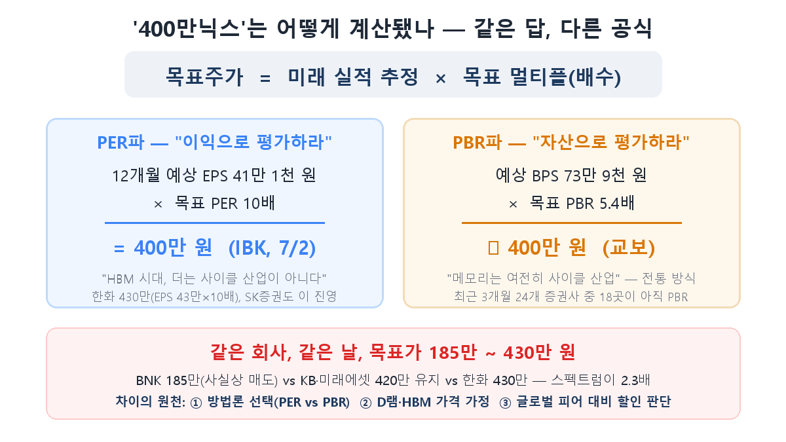
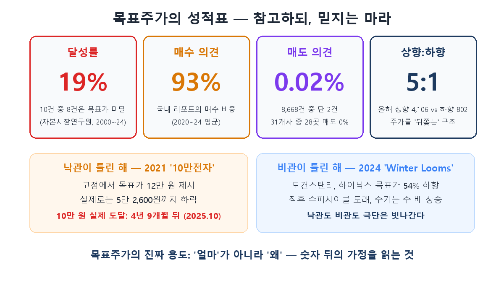

지금 SK하이닉스 주가는 184만 원입니다. 그런데 같은 시장을 보고 있는 증권사들의 목표주가는 BNK투자증권 185만 원부터 한화투자증권 430만 원까지, **2.3배가 벌어져 있습니다.** 한쪽은 사실상 "지금이 제값"이라 하고, 다른 쪽은 "여기서 두 배 더"라고 합니다. 같은 회사, 같은 실적, 같은 뉴스를 보고 어떻게 이런 일이 가능할까요?

답은 목표주가가 '측정'이 아니라 **'가정의 집합'**이기 때문입니다. [8편](/p/kospi-semiconductor/)에서 전문가들이 코스피 10,000과 피크아웃으로 갈라져 있다고 했는데, 오늘은 그 갈라짐이 만들어지는 공장 내부 — 목표주가의 계산실을 견학하겠습니다. 이걸 한 번 보고 나면, "목표가 400만 원 제시!"라는 헤드라인이 전과 다르게 읽힐 겁니다.

## 공식은 하나 — 미래 실적 × 배수

모든 목표주가의 뼈대는 놀랄 만큼 단순합니다. **미래 실적 추정치에 배수(멀티플)를 곱하는 것.** 이익 기준이면 "예상 EPS(주당순이익) × 목표 PER", 자산 기준이면 "예상 BPS(주당순자산) × 목표 PBR"입니다. 실제 리포트의 계산식을 보죠.

IBK투자증권 김운호 연구원이 7월 2일 하이닉스 목표가를 180만 원에서 400만 원으로 올렸을 때의 산식은 이렇습니다: **12개월 예상 EPS 41만 1천 원 × PER 10배 = 400만 원.** 한화투자증권의 430만 원도 같은 구조입니다(EPS 42만 9,777원 × 10배). 반면 교보증권은 **예상 BPS 73만 9,083원 × 목표 PBR 5.4배**로 접근해 비슷한 숫자에 도달했습니다.

공식이 이렇게 단순하다면, 목표가가 2.3배씩 벌어지는 이유는 명확합니다. **곱셈의 양쪽 항이 전부 '추정'이기 때문입니다.** 갈라지는 지점은 정확히 세 곳입니다.

## 갈라짐 ① — 어떤 잣대를 쓸 것인가 (PER vs PBR)

메모리 반도체는 전통적으로 **PBR로 평가하는 산업**이었습니다. 4편에서 본 것처럼 이익이 사이클마다 롤러코스터를 타니, 출렁이는 이익(PER) 대신 안정적인 순자산(PBR)을 기준 삼아 "호황엔 PBR 밴드 상단, 불황엔 하단"을 오가는 식이었죠.

그런데 이번 사이클에서 노무라와 SK증권이 반란을 일으켰습니다. "HBM은 장기계약(1편) 기반이라 이익 안정성이 생겼다. 더는 사이클 산업이 아니니 **PER로 평가해야 한다**"는 겁니다. 하이닉스의 선행 PER은 6~7배 — TSMC의 20배와 비교하면 3분의 1입니다. PER 잣대를 들이대는 순간 "저평가"라는 결론이 나오고, 400만 원대 목표가가 정당화됩니다.

흥미로운 건 세력 분포입니다. 최근 3개월 하이닉스 리포트를 낸 24개 증권사 중 **18곳은 여전히 PBR을 씁니다.** PER 단독파는 IBK·한화·유진·SK증권 등 소수죠. LS증권 황산해 연구원은 낮은 PER에 대해 "이익 지속가능성을 시장이 검증하는 기간"이라는 반론을 폅니다 — 4편의 "이번엔 다르다" 논쟁이, 밸류에이션 방법론 선택이라는 형태로 그대로 재연되고 있는 겁니다.

## 갈라짐 ② — 실적을 얼마로 볼 것인가

곱셈의 앞항인 실적 추정도 만만치 않습니다. 애널리스트들은 D램 계약가격 상승률, 출하량(빗그로스), HBM 비중, 환율을 가정해 분기 실적을 쌓아 올리는데, 이 가정이 조금만 달라져도 결과가 크게 벌어집니다. 실제로 하이닉스의 2026년 영업이익 추정치는 증권사별로 **223조~281조 원**까지 퍼져 있습니다. 스프레드가 58조 원 — 삼성전자의 작년 연간 영업이익보다 큰 금액이 '추정치 차이'로 존재하는 겁니다.

지난 5월 한국투자증권이 삼성전자 목표가를 37만→57만 원으로 한 번에 54% 올린 것도 공식이 바뀐 게 아니라 **가정이 바뀐** 결과였습니다. 2분기 범용 D램 가격 상승률 가정을 30%에서 60%로 올리자 이익 추정이 뛰었고, ROE 50% 가정에서 목표 PBR 5배가 나온 거죠.

## 갈라짐 ③ — 그래서 몇 배를 쳐줄 것인가

마지막으로 목표 멀티플 자체가 판단입니다. 근거는 보통 역사적 밴드(과거 이 종목이 몇 배까지 받아봤나)와 글로벌 피어 비교(마이크론 9배, TSMC 20배, 엔비디아…)인데, "한국 메모리가 TSMC 대비 얼마나 할인받아야 하는가"에는 정답이 없습니다. 노무라의 삼성전자 67만 원(6/24 상향)의 논리가 정확히 "TSMC 몸값을 따라가야 한다"였습니다.

## 목표주가의 성적표 — 참고하되, 믿지는 마라

그럼 이렇게 만들어진 숫자의 실제 성적은 어떨까요. 자본시장연구원이 2000~2024년 약 74만 건의 리포트를 분석한 결과가 있습니다.

**달성률 19%.** 목표주가를 제시한 리포트 10건 중 8건은 끝내 그 가격에 도달하지 못했습니다. 그리고 국내 리포트의 93%가 매수 의견이고, 매도 의견은 8,668건 중 2건(0.02%)이었습니다. 31개 증권사 중 28곳은 매도 리포트가 아예 0건입니다. 증권사가 기업금융·수수료로 먹고사는 구조상 커버리지 기업에 매도를 내기 어렵다는 건 공공연한 사실이고요. 올해 목표가 조정도 상향 4,106건 vs 하향 802건 — 5:1입니다. 목표주가가 주가를 이끄는 게 아니라 **주가를 뒤쫓아 올라가는** 구조라는 비판이 나오는 이유입니다.

역사도 겸손을 가르칩니다. 2021년 "10만전자" 시절, 고점에서 증권가는 목표가 12만 원을 불렀지만 주가는 5만 2,600원까지 떨어졌고, 삼성전자가 실제로 10만 원을 찍은 건 **4년 9개월 뒤**였습니다. 반대 방향도 있습니다. 2024년 모건스탠리는 'Winter Looms(겨울이 온다)' 리포트로 하이닉스 목표가를 54% 내렸는데, 직후 슈퍼사이클이 왔죠. 낙관도 비관도, 극단은 빗나갑니다.

그래서 지금 상황이 교과서적입니다. 급락 후 컨센서스 평균 목표가는 310만 원대, 현재가 대비 +70%의 괴리. 이 괴리를 "상승 여력"으로 읽을지 "아직 안 내려온 눈높이"로 읽을지 — 그 판단은 목표가 숫자가 아니라 그 뒤의 가정(D램 가격이 내년에도 오르는가, HBM 이익은 정말 안정적인가)을 봐야 가능합니다.

## 정리

- 목표주가 = **미래 실적 추정 × 목표 멀티플.** '400만닉스'는 EPS 41만 원 × PER 10배(IBK), 혹은 BPS 74만 원 × PBR 5.4배(교보) — 공식은 단순하지만 양쪽 항이 모두 가정입니다.
- 같은 날 목표가가 185만~430만으로 갈리는 원천은 세 가지 — **① PER vs PBR 방법론(24곳 중 18곳은 아직 PBR), ② 실적 가정(영업이익 추정 223~281조), ③ 피어 대비 할인 판단.** 방법론 선택 자체가 "이번엔 다르다" 논쟁의 대리전입니다.
- 성적표는 냉정합니다 — **달성률 19%, 매수 의견 93%, 매도 0.02%, 상향:하향 5:1.** 목표주가는 예언이 아니라 후행하는 의견입니다.
- 목표주가의 올바른 사용법: '얼마'는 버리고 **'왜'를 읽으세요.** 어떤 가정(D램 가격·HBM 비중·멀티플)이 깔려 있는지를 보면, 그 가정이 깨지는 순간을 스스로 알아챌 수 있습니다.

다음 10편은 시리즈의 마지막, 그 가정들이 맞았는지 확인하는 현장입니다 — **하이닉스 실적발표(실적 시즌) 따라 읽는 법**으로 교과서를 완성합니다.

> ⚠️ 이 글은 공부한 내용을 정리한 것으로, 특정 종목의 매수·매도 추천이 아닙니다. 인용된 목표주가와 전문가 견해는 해당 시점의 의견이며 언제든 바뀔 수 있습니다. 투자 판단과 책임은 본인에게 있습니다.
