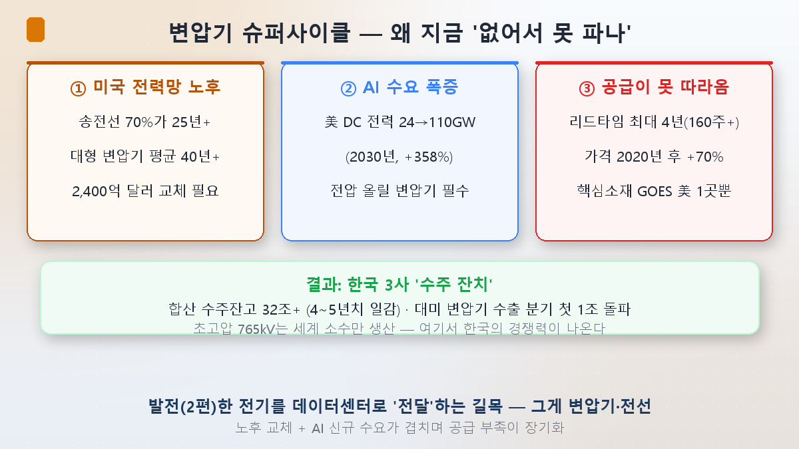
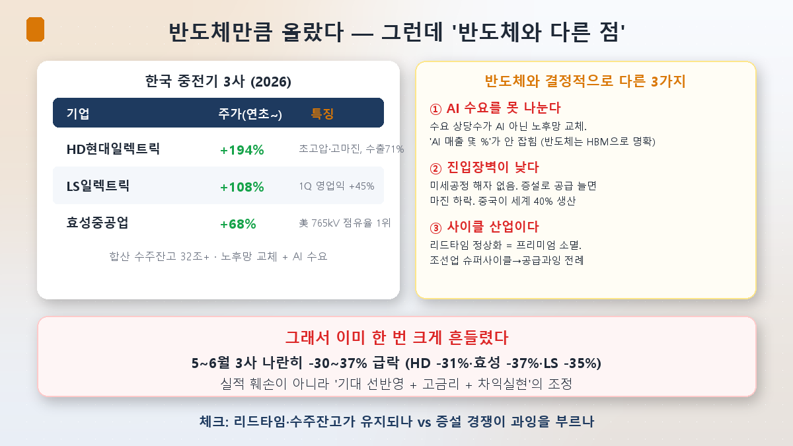

数年前まで「変圧器会社」は株式投資家にとって最も退屈な銘柄でした。成長はなく配当だけの煙突産業。ところがHD現代エレクトリックの株価がこの2年で数倍に跳ね、時価総額40兆を超えました。半導体筆頭株に劣らない上昇です。発電所でも半導体でもないこの「変圧器を作る会社」が、なぜAI時代の主役になったのでしょうか。

[第2回](/ja/p/smr-nuclear-ai/)で発電（原発・SMR）を見ました。今日はその次の要衝、**「送配」**です。発電所が作った電気をデータセンターまで運ぶ設備——変圧器・電線・電力網。結論から言えば、ここには本物のスーパーサイクルがあります。ただ半導体とは性格が微妙に異なり、その違いを知るのが今日の核心です。

## なぜ変圧器がボトルネックなのか

電気は発電所で作ってそのままデータセンターに挿すのではありません。遠くへ送るには電圧を一気に上げ（超高圧送電）、使う時にまた下げる（配電）——その電圧を上げ下げする装置が**変圧器**です。特に大型データセンターは数十万世帯級の電気を引き込む必要があり、専用変電所と超高圧変圧器が必須です。発電をいくら増やしても、これを運ぶ変圧器がなければ電気はデータセンターに届きません。

問題は3つが同時に起きたことです。

**① 米国の電力網が古い。**米国の送電線の70%が25年以上、大型変圧器の平均年齢は40年を超えます。もともと交換時期でした。**② そこにAIが襲った。**米国データセンターの電力需要が2026年24GWから2030年110GWへ358%増える見通し。**③ しかし供給が追いつかない。**変圧器の納期（リードタイム）が通常1年から最大4年（160週以上）まで延び、価格は2020年以降70%超上昇。変圧器の核心素材である方向性電磁鋼板（GOES）を米国で作る会社が1社だけで、構造的に納期を縮められません。

需要は爆発するのに供給は増えない——第1回で見たその不均衡が変圧器で最も極端に現れたのです。結果、韓国重電3社の合算受注残高が32兆を超え4～5年分の仕事を積み、対米変圧器輸出は四半期ベースで初めて1兆を突破しました。

## 韓国3社が勝っている理由

ここで韓国が強い。超高圧、特に765kV級変圧器は世界で少数の企業しか作れない高難度製品で、韓国3社が低い不良率と納期遵守で米国市場を切り開きました。

- **HD現代エレクトリック**：超高圧変圧器中心の高マージン構造、輸出比率71%。テキサス最大の電力会社に765kV変圧器を受注、2026年営業利益率が20%超。株価は年初比+194%。
- **LSエレクトリック**：第1四半期の営業利益が45%増で四半期最大。変圧器に配電・自動化まで幅広い。株価+108%。
- **暁星重工業**：米国メンフィスに現地唯一の765kV工場を持ち点有率1位。株価+68%。

第5回で見る「発電-送電-配電」の流れのうち、この3社が「送電」の核心の関門を握っているわけです。

## しかし — 半導体と決定的に異なる3点

ここまでなら「第二の半導体」に聞こえます。しかし正直に押さえるべき違いがあります。これが今日の本当の核心です。

**① AI需要をきっちり分けられない。**半導体はHBMという形で「これはAI売上」と明確に区分されます。ところが変圧器需要の相当部分はAIデータセンターではなく**ただの老朽電力網の交換**です。「AIテーマ」で括られて上がりますが、実際の売上で純AI向けが何%かは会社もきちんと分けません。つまり「AI株」というラベルが半導体より緩いのです。

**② 参入障壁が半導体より低い。**半導体は微細化という巨大な堀があり誰でも作れません（第1・5回）。変圧器は標準に合わせて生産ラインを整えれば大量生産が可能です。実際、中国が世界の変圧器の40%を作り、メキシコなどを迂回して米国市場進出を狙っています。いまの韓国の優位（短納期・低不良率）は実力ですが、半導体のような圧倒的な堀ではありません。

**③ 典型的なサイクル産業。**いまのプレミアムの源泉である「長いリードタイム」は、裏返せばリスクです。世界中が変圧器工場を増設しており、納期が正常化した瞬間に価格プレミアムも萎みます。造船業が2000年代スーパーサイクル後、大規模増設と中国の追撃で長い不況を経た前例があります。「好況→増設競争→供給過剰」はサイクル産業の宿命です（第4回の豚サイクル論理そのまま）。

だからこれらの銘柄はすでに一度大きく揺れました。**5～6月に3社が揃って30～37%急落**（HD現代 -31%、暁星 -37%、LS -35%）。業績が悪化したのではなく、期待が過度に織り込まれた上に高金利・利益確定が重なった調整でした。受注残高は依然堅調なのに株価だけ大きく揺れた——第8回（[KOSPIの集中](/ja/p/kospi-semiconductor/)）で見た、期待が先走った所で起きる変動性です。

## 投資家の注目ポイント

- **「送配」は発電より実績が実物**：第2回のSMRがまだ未来の売上なら、変圧器はすでに受注残高と実績で証明されています。これは強みです。
- **見るべきはリードタイムと増設**：スーパーサイクルが続くにはリードタイム（供給不足）が長く続く必要があります。世界的な増設がこれをいつ解消するか——その時点がサイクルの高点シグナルです。
- **「AI株」というラベルを疑う**：この会社の売上で実際のAIデータセンター向けがいくらか、老朽交換需要と混ざっていないかを見るべきです。第7回（[装置・素材・部品](/ja/p/semiconductor-suppliers/)）で学んだ「テーマラベルではなく実際の売上比率」がここにも当てはまります。

## まとめ

- AI電力難の「送配」の要衝を変圧器・電線が握っています。**米国電力網の老朽＋AI需要急増＋供給不足（リードタイム4年）**が重なり本物のスーパーサイクルが来て、韓国3社（HD現代エレクトリック・暁星重工業・LSエレクトリック）が超高圧競争力で恩恵を受けました。
- ただし半導体とは違います——**① AI需要を分けられず（老朽交換需要と混在）、② 参入障壁が低く（中国40%生産）、③ サイクル産業（増設→供給過剰リスク）**です。
- だからすでに5～6月に30%台の調整を経ました。**リードタイム維持 vs 増設過剰**が今後の核心の注目点です。

次回・第4回はこの電力テーマ全体にブレーキをかけます。原発も変圧器も熱いが——**これは本物のスーパーサイクルか、それとも泡か？**AI半導体第4回でした問いを電力にも投げます。

> ⚠️ この記事は学んだ内容の整理であり、特定銘柄の売買を推奨するものではありません。引用した数値と見通しは当時のものでありいつでも変わり得ます。投資判断とその責任はご自身にあります。
