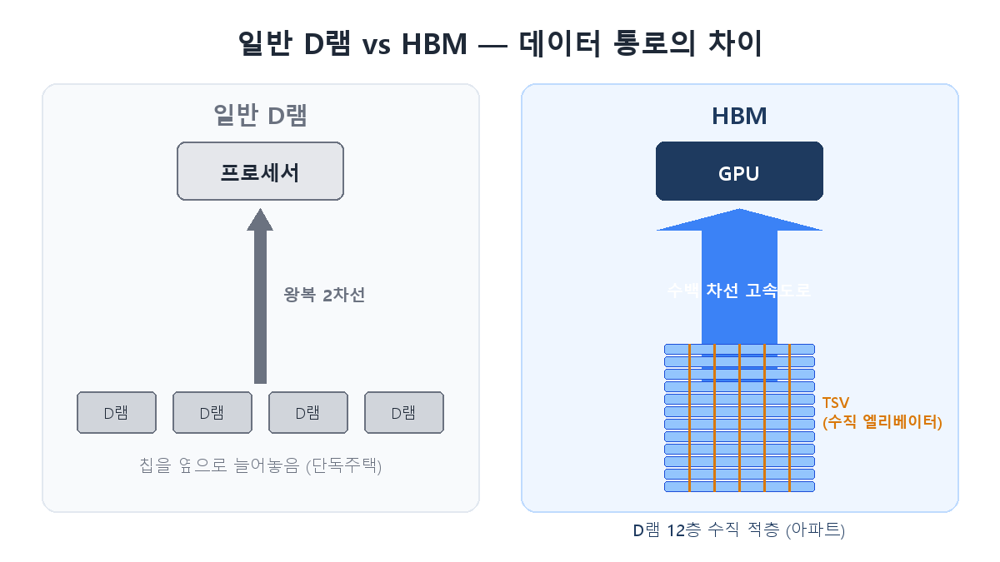
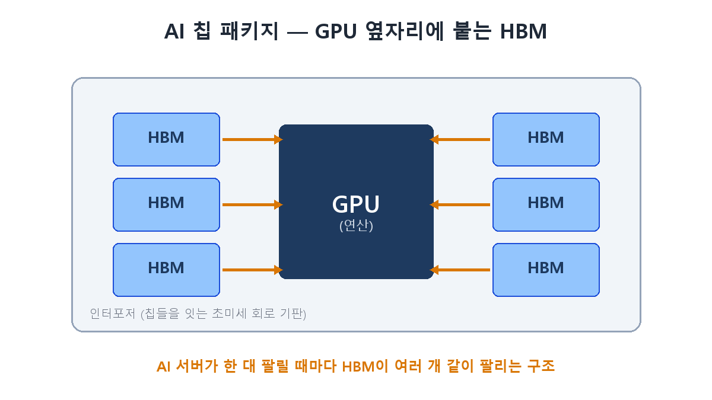

If you follow financial news these days, one word keeps popping up: **HBM**. "SK hynix posts record earnings on HBM," "the HBM4 race heats up"… Many of you have probably already bought Samsung or SK hynix on headlines like these — or are wondering if you should. Yet ask "so what exactly is HBM?" and few can answer clearly. **If your money is in a company, you should know what it actually makes money from** — that's what keeps you steady when the headlines swing. Let's settle it in this post.

## HBM is 'memory stacked like an apartment building'

HBM stands for **High Bandwidth Memory**, and the core idea is surprisingly simple. If ordinary DRAM is a row of single-story houses laid side by side, HBM **stacks DRAM chips vertically — 8, 12, even 16 stories high, like an apartment tower**.

And it's not just stacking. The floors are connected by thousands of microscopic elevators called **TSVs (Through-Silicon Vias)**, which massively widen the path data travels. If ordinary DRAM is a two-lane road, HBM is a **highway with hundreds of lanes**. That's where the name "high bandwidth" comes from.

## Why AI can't live without HBM

The star of AI computing is Nvidia's GPU. But GPUs have long had one nagging problem: compute speed has grown explosively, while **the memory feeding it data can't keep up**. Even the best chef (the GPU) sits idle if ingredients (data) don't arrive on time. The industry calls this the **"memory wall."**

HBM is the answer to that wall. It sits right next to the GPU and pours in data through that hundreds-of-lanes highway. That's why every Nvidia AI chip ships with multiple HBM stacks attached — **every AI server sold means HBM sold along with it**. If semiconductors are the "rice of industry," this is why HBM is called the "rice of the AI era."

## Why it makes money — the decisive difference from ordinary DRAM

Here's what matters to investors: HBM sells for **several times the price of ordinary DRAM.** Two reasons.

| | Ordinary DRAM | HBM |
|---|---|---|
| Structure | Single chip | 8–16 stacked chips + TSVs |
| Difficulty | Relatively easy | Very hard (yield is everything) |
| Pricing | Commodity, swings with the market | High value-added, long-term contracts |
| Customers | Broad market | A few giants like Nvidia |

First, **it's hard to make.** Stacking thinned chips and connecting them through thousands of holes means one defective layer scraps the whole stack — only companies that master yield make money. Second, **it's sold differently.** Commodity DRAM is sold at market prices that swing with the cycle, while HBM is pre-contracted with big buyers like Nvidia a year or two in advance, making earnings far more stable.

Memory used to be a boom-and-bust rollercoaster industry. HBM is rewriting that formula.

## Who makes it today

Only three companies in the world can make HBM: **SK hynix, Samsung Electronics, and Micron.** SK hynix has led the market by locking in Nvidia's supply, and this year the battle has shifted to the next-generation standard, **HBM4** (destined for Nvidia's next platform, "Rubin"). With analysts projecting SK hynix will hold around 70% of the HBM4 market, price targets have been raised across the board. We'll dig into that battle in part 2 of this series.

## Recap

- HBM is **DRAM stacked vertically to maximize data bandwidth** — the essential part that breaks the GPU's "memory wall."
- It's hard to make and sold through **long-term contracts** to a few large customers, so it's far pricier and more stable than commodity DRAM.
- Only SK hynix, Samsung, and Micron can supply it, and the **HBM4 race** is now the key variable for these stocks.

> ⚠️ This post is a summary of my own learning, not a recommendation to buy or sell any security. Investment decisions and responsibility are your own.
