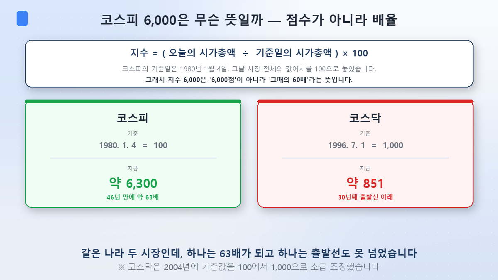
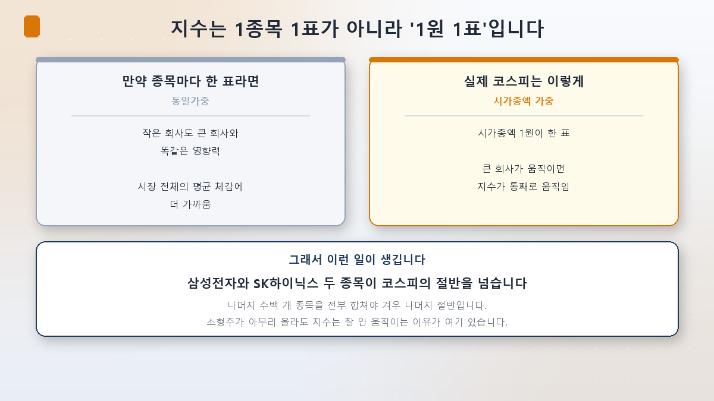
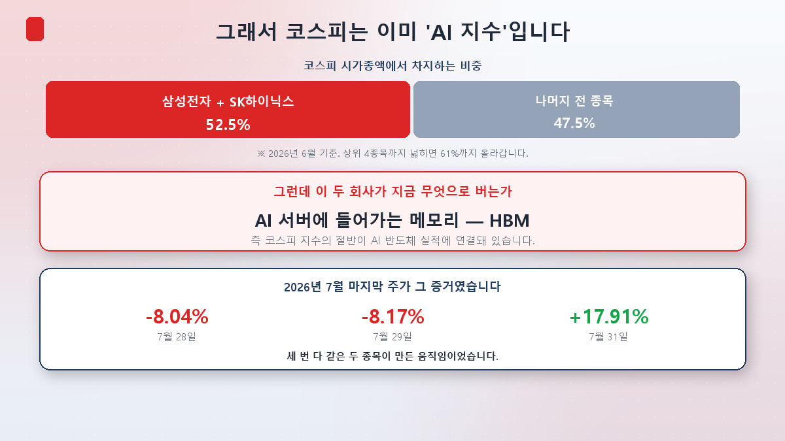

新系列开始了。[AI芯片教科书](/zh/p/what-is-hbm/)挖的是AI的**零件**，[AI电力教科书](/zh/p/ai-power-hunger/)挖的是AI的**燃料**，这一次我们要处理的是被AI吞掉的**市场本身**。

先从上周说起。**7月31日，韩国综指单日大涨17.91%**，跳升1,001点收在6,595.45——这是46年来最大的单日涨幅和最大点数涨幅。可就在三天前的7月28日和29日，还连续两天触发了熔断。

一周之内−8%、−8%，然后+17.9%。是什么造出了这些？说来惊人，**实际上只是两只股票。**

要读懂这件事，得先明白"指数到底是什么"。今天就从这里出发。

## 韩国综指6,000不是"6,000分"

很多人把指数当成考试分数。可指数**不是分数，是倍数**。

公式意外地简单。

> **指数 =（今天的总市值 ÷ 基准日的总市值）× 100**

韩国综指的基准日是**1980年1月4日**。那天全部上市公司加起来的价值被定为100。所以指数6,000的意思是，**整个市场比那时大了60倍**。如今在6,300一线，大约是63倍。

明白这点，新闻就变得不一样了。"综指突破6,000"不是越过了某个目标分数，而是说市场规模已是46年前的60倍。

**创业板的基准不同。**它1996年7月1日开市，把当天定为100；2004年又把这个基准**追溯上调为1,000**，因为指数数字太小、显示起来不方便。

于是就出现了一个有意思、也有点苦涩的对比。同一个国家的两个市场，**综指变成了63倍，而创业板走了30年，连出发线1,000都还没夺回来。**为什么会这样，这个系列会慢慢拆。

## 指数不是"一只股票一票"，是"一元一票"

这是关键。算指数时，并不是每只股票给同样的一票。

韩国综指采用**市值加权**。可以理解成：一元市值就是一票。市值100万亿的公司，投票权是1万亿公司的**100倍**。

如果是一只股票一票（等权重），指数会更贴近"市场上普通个股的平均感受"。但真实的综指不是这样。**大公司一动，整个指数跟着动。**

于是就有了那种熟悉的体验：自己的账户一片惨绿，新闻却说"综指收涨"。几十只小盘股下跌，只要一只超大盘股上涨，指数就是涨的。**指数和你的体感对不上，不是错觉，是结构。**

## 所以韩国综指早已是一个"AI指数"

进入正题。

截至2026年6月，**三星电子和SK海力士两只股票就占韩国综指市值的52.5%**。若放宽到前四大（三星电子、SK海力士、三星电子优先股、SK Square），达到**61%**。

两只股票超过一半，剩下几百只股票**全部加起来**才勉强凑成另一半。

再往前一步想。**这两家公司现在靠什么赚钱？**给AI服务器用的高带宽内存——**HBM**。芯片教科书[第2篇](/zh/p/hbm4-war/)讲过HBM4之战，[第3篇](/zh/p/samsung-vs-hynix/)讲过海力士营业利润首次超过三星。

归纳起来就是：**韩国综指有一半绑在AI半导体的业绩上。**

上周那场创纪录的剧烈震荡，也就说得通了。

- **7月28日 −8.04%、29日 −8.17%**：中国长鑫存储（CXMT）在上海成功上市，追赶威胁被放大，同时SK海力士业绩不及预期。
- **7月31日 +17.91%**：美国科技巨头业绩亮眼，三星电子大涨26.81%，SK海力士封上**涨停**——这是30%涨跌幅制度实施以来海力士的首次涨停。

三次都是同样两只股票造出来的。（这一周发生的事，[第3篇]会单独细讲。）

## 投资者视角 — 这为什么重要

**① "我买了综指ETF，所以分散了"未必成立。**买跟踪综指的产品，感觉像持有几百家公司，实际上**一半以上是两只AI半导体股**。你以为的分散，可能是一次集中押注。

**② 指数和你的账户走不到一起，是正常的。**在市值加权结构下，超大盘股拉着指数走。持有中小盘股的话，"综指涨了我没涨"才是意料之中。

**③ 看指数新闻要多看一层。**看到"综指暴涨/暴跌"的标题，养成追问**是什么造成的**的习惯。在当下的市场，答案通常是固定的那几个。

**④ 这不只是韩国的故事。**美国标普500里少数科技巨头的权重大幅上升，也在引发类似争论。AI吞掉指数，更接近一个全球现象。

## 小结

- **指数是倍数，不是分数。**综指 =（今天市值 ÷ 1980年1月4日市值）× 100。6,000意味着是46年前的60倍。创业板以1996年7月1日为基准（2004年追溯调至1,000），走了30年仍在出发线之下。
- **指数是一元一票。**市值加权让大公司主导指数。指数与你的收益率脱节是结构性的，不是错觉。
- **韩国综指已经是AI指数。**三星电子与SK海力士占市值52.5%，前四大占61%。而这些公司靠AI内存赚钱。**买综指，很大程度上就是押注AI。**

下一篇[第2篇]，我们正面拆解这种集中：**指数被两只股票绑架了**——市值加权这套办法是怎么走到今天的，以及它对投资者到底意味着什么。

> ⚠️ 本文仅为个人学习整理，不构成任何证券的买卖建议。所引数值为当时情况，随时可能改变。投资决策及责任由本人承担。
