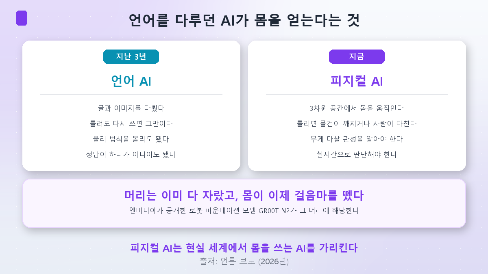
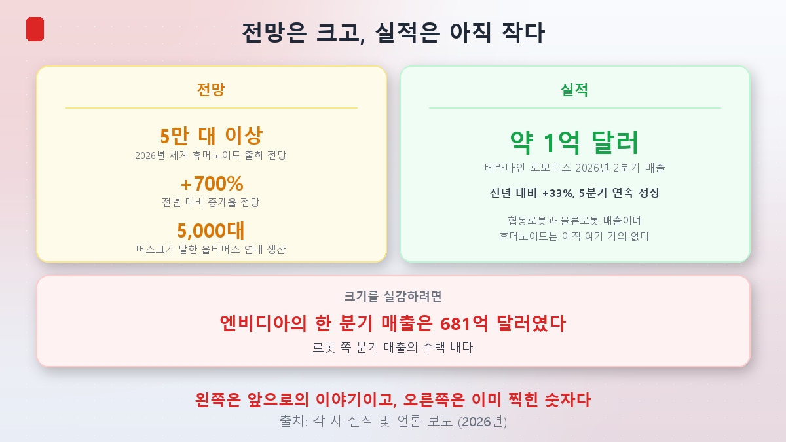
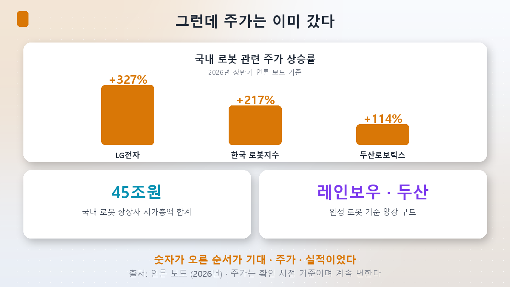
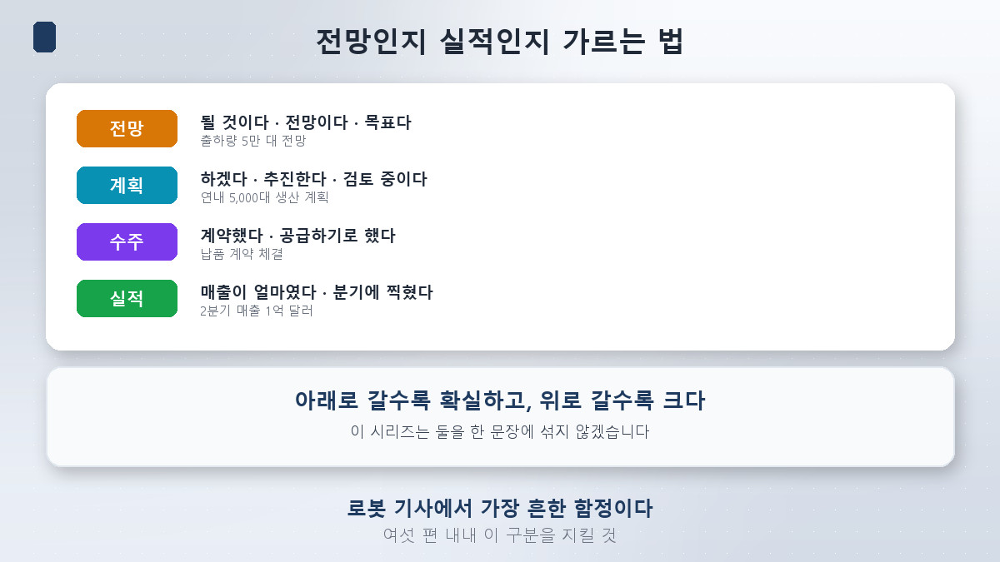

여섯 번째 시리즈를 시작합니다.

[지난 시리즈](/p/how-to-read-rates/)를 끝내며 이렇게 썼습니다. 매번 앞 시리즈에서 설명하지 못하고 남긴 것이 다음 주제가 됐다고요. 이번에도 그렇습니다.

[반도체](/p/what-is-hbm/)에서 AI의 **부품**을, 전력에서 **연료**를, 지수에서 **시장**을, 순환매에서 **돈의 이동**을, 금리에서 **돈의 값**을 봤습니다. 그러면 남은 질문은 하나입니다.

> **그래서 AI가 실제로 무엇이 되는가.**

답은 **몸**입니다.

## 손이 없는 천재를 고용했다면

아주 똑똑한 사람을 한 명 고용했다고 해봅시다. 박사 학위가 여럿이고 무엇이든 압니다. 그런데 이 사람에게는 **손이 없습니다.** 할 수 있는 건 말로 알려주는 것뿐입니다.

지난 3년의 AI가 딱 그랬습니다. 글을 쓰고 그림을 그리고 코드를 짰지만, 컵 하나를 옮기지는 못했습니다.

**피지컬 AI(Physical AI)**는 그 사람에게 손을 붙이는 일입니다.

## 언어를 다루던 AI가 몸을 얻는다는 것

말은 쉬운데, 실제로는 완전히 다른 문제입니다.

| | 언어 AI | 피지컬 AI |
|---|---|---|
| 다루는 것 | 글과 이미지 | 3차원 공간의 물체 |
| 틀렸을 때 | 다시 쓰면 된다 | 물건이 깨지거나 사람이 다친다 |
| 알아야 하는 것 | 언어의 규칙 | 무게·마찰·관성 |
| 시간 | 몇 초 기다려도 된다 | 실시간이어야 한다 |

글은 틀리면 지우면 됩니다. 그런데 로봇 팔이 컵을 잡다가 힘 조절을 틀리면 컵이 깨집니다. **되돌릴 수 없는 세계에서 판단해야 한다**는 게 결정적 차이입니다.

여기서 **엔비디아**가 등장합니다. 로봇의 '두뇌'에 해당하는 **로봇 파운데이션 모델 GR00T N2**를 공개했습니다. 앞서 널리 쓰이던 GR00T N1.7의 후속입니다. 언어 모델이 문장을 예측하듯, 이 모델은 **다음 동작**을 예측합니다.

정리하면 이렇습니다. **머리는 이미 다 자랐고, 몸이 이제 걸음마를 뗐습니다.**

## 지금 어디까지 왔나

여기서부터 조심해야 합니다. 로봇 기사에는 **전망과 실적이 한 문장에 섞여 있는 경우**가 아주 많기 때문입니다.

### 전망 쪽 숫자

- 2026년 전 세계 휴머노이드 출하량 **5만 대 이상**, 전년 대비 **+700%** (시장조사업체 전망)
- 점유율 전망: **중국 30% / 미국 25% / 일본 10%**
- 테슬라는 2026년 1분기 3세대 옵티머스 양산에 들어갔고, 머스크는 3월에 **연내 5,000대 생산**을 언급했습니다

크고 좋은 숫자들입니다. 그런데 **전부 앞으로의 이야기**입니다.

### 실적 쪽 숫자

이미 찍힌 숫자 중 확인 가능한 대표 사례를 하나 보겠습니다.

**테라다인 로보틱스의 2026년 2분기 매출은 약 1억 달러**였습니다. 전년 동기 대비 **33% 증가**했고 **5분기 연속 성장**입니다. 협동로봇 업체 유니버설로봇과 물류용 자율이동로봇 업체 미르가 여기 들어갑니다.

성장률만 보면 훌륭합니다. 그런데 **크기**를 봐야 합니다.

[금리 4편](/p/ai-circular-financing/)에서 확인한 엔비디아의 한 분기 매출이 **681억 2,700만 달러**였습니다. 회계 기준과 분기가 서로 달라 나란히 놓기는 조심스럽지만, **자릿수의 차이는 분명합니다.**

그리고 하나 더. **테라다인의 저 매출은 대부분 공장과 물류창고에서 쓰는 로봇입니다.** 우리가 뉴스에서 보는 두 발로 걷는 휴머노이드는, 아직 저 숫자에 거의 들어 있지 않습니다.

## 그런데 주가는 이미 갔습니다

국내 상황이 이렇습니다.

| 항목 | 수치 |
|---|---|
| 국내 로봇 상장사 시가총액 합계 | **45조원 육박** |
| LG전자 주가 상승률 | **+327%** |
| 한국 로봇지수 수익률 | **+217%** |
| 두산로보틱스 주가 상승률 | **+114%** |

완성 로봇 기준으로는 **레인보우로보틱스(삼성이 지분 투자)와 두산로보틱스**가 양강 구도이고, 부품 쪽에서는 에스피지·삼현·로보티즈 같은 이름이 자주 거론됩니다. 두산로보틱스는 미국 자동화 기업 원엑시아를 **356억원**에 인수했습니다.

숫자가 오른 순서를 보면 이렇습니다. **기대 → 주가 → 실적.** 실적이 아직 맨 뒤에 있습니다.

## 그럼 거품인가요

여기서 손쉽게 결론 내고 싶어집니다. "실적도 없이 주가만 올랐으니 거품이다." 그런데 **그 결론은 성급합니다.** 이유가 둘입니다.

**첫째, 반도체도 그랬습니다.** [반도체 시리즈 1편](/p/what-is-hbm/)에서 HBM을 다뤘을 때, HBM은 이미 실적이 나오고 있었습니다. 하지만 그 전 단계에서는 HBM도 "앞으로 필요해질 것"이라는 기대였습니다. **기대가 먼저 오는 것 자체는 이상한 일이 아닙니다.** 새 산업은 원래 그 순서로 갑니다.

**둘째, 이번엔 돈이 이미 깔려 있습니다.** 금리 시리즈에서 본 그 캐펙스입니다. 빅테크 4사가 올해 7,250억~7,600억 달러를 설비에 쓰고 있고, 그중 상당 부분이 AI를 굴릴 인프라입니다. 로봇의 두뇌를 돌릴 연산 능력은 **이미 지어지는 중**입니다.

다만 반대 방향도 정직하게 적어야겠습니다. **로봇은 반도체와 달리 진입장벽이 낮을 수 있습니다.** 감속기와 모터는 수십 년 된 기계 부품입니다. 그리고 중국이 점유율 30%를 전망받는 이유도 거기 있을 수 있습니다. 이 두 가지는 각각 **2편과 4편**에서 따져보겠습니다.

## 이 시리즈가 지킬 원칙 하나

앞선 다섯 시리즈에서 매번 규칙을 하나씩 얻었습니다. 이번 시리즈의 규칙은 처음부터 분명합니다.

> **전망과 실적을 한 문장에 섞지 않겠습니다.**

로봇 기사에서 가장 흔한 함정이 이것입니다. 문장을 볼 때 이렇게 갈라 읽으시면 됩니다.

| 단계 | 신호가 되는 말 | 예 |
|---|---|---|
| **전망** | 될 것이다 · 전망이다 · 목표다 | 출하량 5만 대 전망 |
| **계획** | 하겠다 · 추진한다 · 검토 중이다 | 연내 5,000대 생산 계획 |
| **수주** | 계약했다 · 공급하기로 했다 | 납품 계약 체결 |
| **실적** | 매출이 얼마였다 · 분기에 찍혔다 | 2분기 매출 1억 달러 |

**아래로 갈수록 확실하고, 위로 갈수록 큽니다.** 둘 다 필요한 정보지만, 섞이면 판단이 흐려집니다.

이번 시리즈는 전망이 압도적으로 많은 분야를 다룹니다. 앞선 다섯 시리즈 중 이 점에서 가장 위험한 조건입니다. 그래서 이 원칙을 먼저 걸어두고 시작합니다.

## 정리

- **피지컬 AI는 언어를 다루던 AI가 3차원 현실에서 몸을 쓰는 단계**를 가리킵니다. 되돌릴 수 없는 세계에서 실시간으로 판단해야 한다는 게 결정적 차이이고, 엔비디아의 로봇 파운데이션 모델 **GR00T N2**가 그 두뇌에 해당합니다.
- **전망은 큽니다.** 2026년 세계 휴머노이드 출하량 **5만 대 이상(+700%)** 전망, 점유율은 중국 30%·미국 25%·일본 10% 전망. 테슬라는 옵티머스 **연내 5,000대**를 언급했습니다.
- **실적은 아직 작습니다.** 확인 가능한 대표 사례인 테라다인 로보틱스의 2026년 2분기 매출은 **약 1억 달러**(+33%, 5분기 연속 성장)이고, 그마저 대부분 공장·물류용 로봇입니다.
- **주가는 이미 갔습니다.** 국내 로봇 상장사 시총 **45조원 육박**, LG전자 **+327%**, 한국 로봇지수 **+217%**, 두산로보틱스 **+114%**. 순서가 **기대 → 주가 → 실적**입니다.
- **그렇다고 거품이라 단정하지는 않겠습니다.** 새 산업은 원래 기대가 먼저 옵니다. 다만 로봇 부품은 반도체보다 진입장벽이 낮을 수 있고, 중국 점유율 전망도 거기서 나옵니다. **2편과 4편**에서 따져보겠습니다.
- **이번 시리즈의 원칙: 전망과 실적을 한 문장에 섞지 않습니다.**

다음 편에서는 **로봇의 몸값**을 봅니다. 휴머노이드 한 대에서 가장 비싼 부품이 무엇이고 누가 만드는지, 그리고 반도체 시리즈에서 썼던 **"완성품 말고 부품을 보라"**는 문법이 로봇에도 통하는지 확인하겠습니다.

> ⚠️ 이 글은 개인 학습 정리이며 특정 종목이나 투자 방식에 대한 권유가 아닙니다. 본문의 출하량·점유율·생산 대수는 모두 **전망 또는 계획**이며 실현을 보장하지 않습니다. 매출은 각 사 발표 기준이고, 서로 다른 회사의 분기는 회계 기준과 기간이 달라 직접 비교에 한계가 있어 자릿수 참고용으로만 제시했습니다. 주가 상승률과 시가총액은 확인 시점(2026년 9월 2일)의 언론 보도 기준이며, 로봇 관련주는 변동성이 특히 큽니다. 언급한 기업명은 산업 구조를 설명하기 위한 예시이며 매수·매도 의견이 아닙니다. 달러 금액은 환율 변동을 고려해 원화 환산을 생략했습니다. 투자 판단과 그 결과는 본인의 몫입니다.
