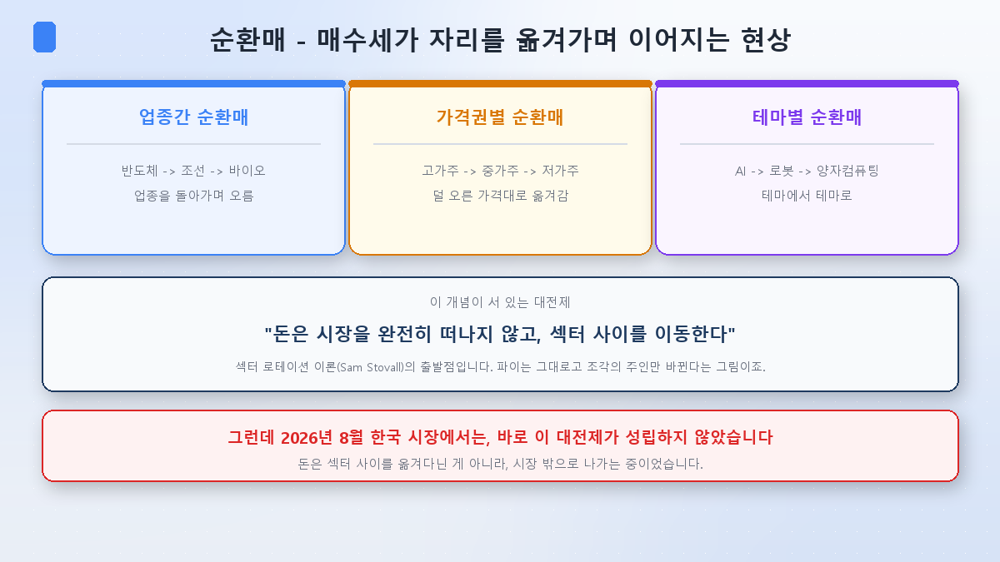
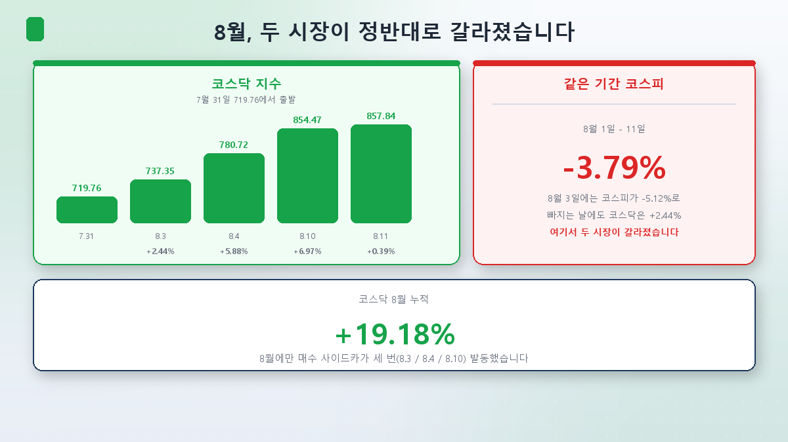
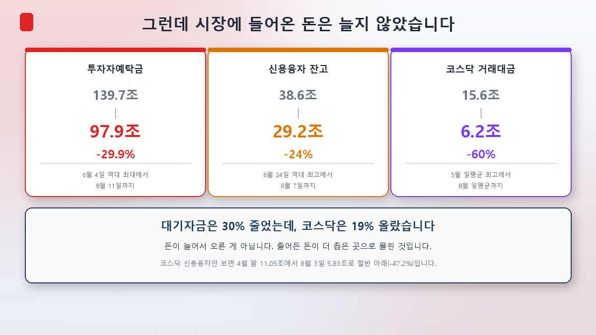
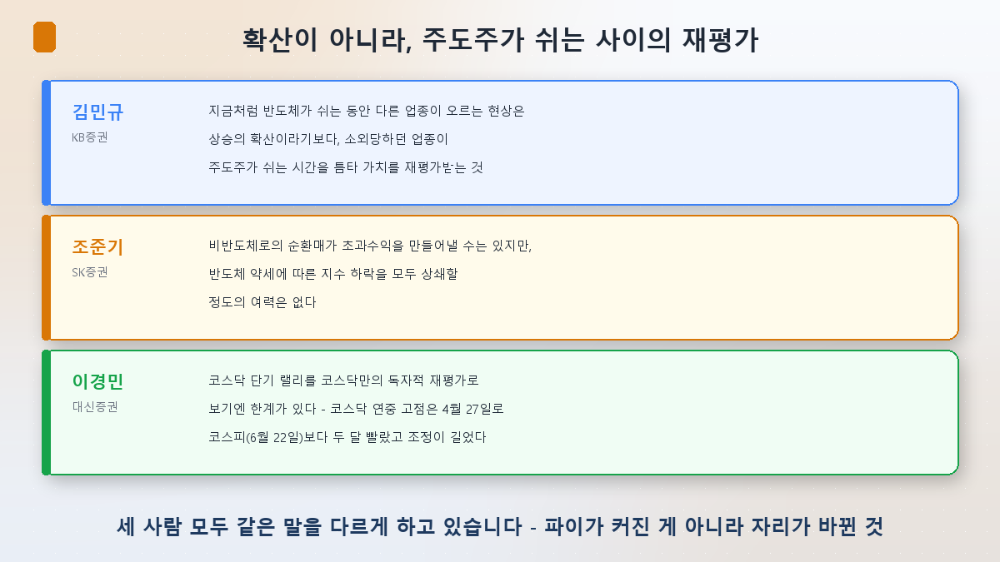
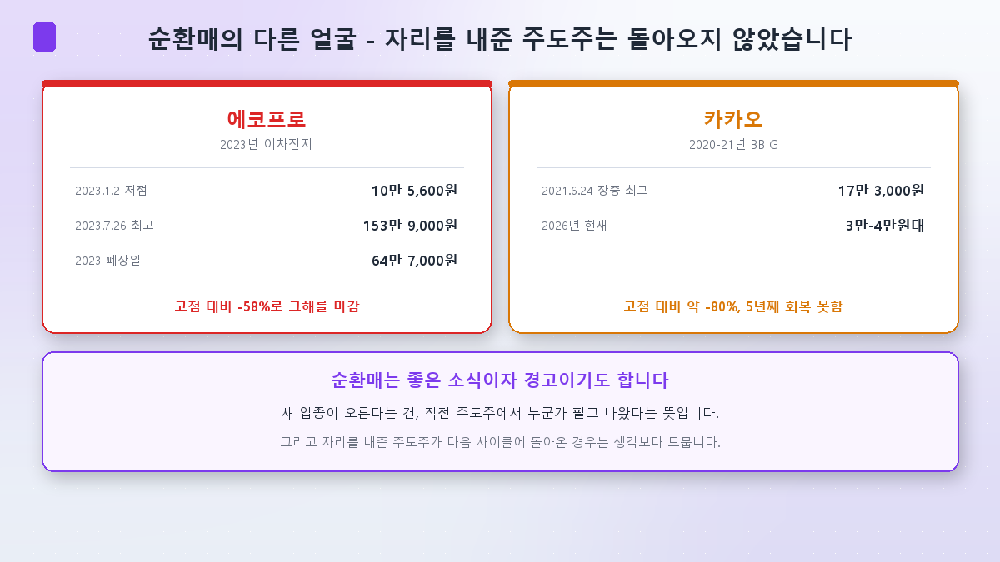

새 시리즈를 시작합니다.

지난 27편 동안 저는 AI라는 돈이 어디를 지나가는지를 따라왔습니다. [반도체](/p/what-is-hbm/)에서 부품을 봤고, [전력](/p/ai-power-hunger/)에서 연료를 봤고, [지수](/p/what-is-kospi-index/)에서 그 AI가 삼켜버린 시장 전체를 봤습니다. 이번 시리즈의 자리는 그 다음입니다. **그 돈이 지금 어디로 옮겨가고 있는가.**

마침 지난 2주가 딱 그 장면이었습니다. 8월 들어 뉴스에 '순환매'라는 단어가 부쩍 늘었습니다. 그래서 첫 편은 이 단어부터 열어보려 합니다.

## 순환매란 무엇인가

파티장을 떠올려 보시면 쉽습니다. 사람들이 이 방에서 저 방으로 몰려다닙니다. 한 방이 붐비다가 조용해지면, 옆방이 시끄러워집니다. 주식시장에서 그런 일이 벌어지는 게 순환매입니다.

정의하자면 **어떤 업종이나 종목이 오른 뒤, 매수세가 다음 대상으로 순차적으로 옮겨가며 상승이 이어지는 현상**입니다.

보통 세 가지 형태로 나눕니다.

- **업종간 순환매** — 반도체가 쉬면 조선이, 조선이 쉬면 바이오가 오르는 식
- **가격권별 순환매** — 고가주가 오른 뒤 중가주, 저가주로 내려오는 흐름
- **테마별 순환매** — AI에서 로봇으로, 로봇에서 양자컴퓨팅으로

이 개념 뒤에는 오래된 이론이 있습니다. 섹터 로테이션(sector rotation)이라고 부르는데, 1990년대에 샘 스토발이 1945년 이후 모든 경기 사이클의 업종별 성과를 분석해 체계화한 게 유명합니다. 경기 국면마다 유리한 업종이 다르다는 이야기죠. 메릴린치의 '투자 시계'도 같은 계열입니다.

그런데 이 이론들이 공통으로 깔고 있는 전제가 하나 있습니다. 저는 이번 편에서 이 전제를 가장 중요하게 보고 있습니다.

> **"돈은 시장을 완전히 떠나지 않고, 섹터 사이를 이동한다."**

파이는 그대로고 조각의 주인만 바뀐다는 그림입니다. '순환'이라는 말 자체가 그 뜻이고요.

**이번 8월, 한국에서는 이 전제가 성립하지 않았습니다.** 그게 이 글의 요점입니다.

## 먼저, 8월에 실제로 벌어진 일

7월 말까지 719.76이던 코스닥이 8월 11일 857.84로 마감했습니다. **+19.18%**입니다. 같은 기간 코스피는 **-3.79%**였고요.

갈라진 시점이 분명합니다. **8월 3일**입니다. 그날 코스피는 -5.12%(6,257.45)로 크게 빠졌는데, 코스닥은 +2.44%(737.35)로 올랐습니다. 그 뒤로 8월 4일 +5.88%(780.72), 8월 10일 **+6.97%**(854.47), 8월 11일 +0.39%(857.84).

8월 10일은 특히 극적이었습니다. 코스닥 상승 종목이 **1,431개**로 전체의 80%를 넘었고 상한가만 11개였습니다. 오전 9시 50분에는 코스닥150 선물과 지수가 각각 6.05%, 6.25% 오른 상태가 1분 이상 이어지면서 **매수 사이드카**가 걸렸습니다. 8월 들어 세 번째였습니다(8월 3일, 4일, 10일).

주도한 건 바이오와 로봇, 반도체 소부장이었습니다. 코스닥150 헬스케어 지수는 8월에만 35% 가까이 올랐고요. 코스닥 시총 1위 알테오젠은 8월 7일 블랙록이 지분 5.03%(269만 4,448주) 보유를 공시한 것이 촉매가 되어 10% 넘게 뛰었습니다.

배경도 뚜렷합니다. 삼성전자와 SK하이닉스의 시가총액 비중이 7월 53.2%에서 8월 1일 51.16%로 낮아졌습니다. [지수 2편](/p/index-concentration-trap/)에서 다룬 그 쏠림이 조금 풀린 겁니다.

여기까지만 보면 교과서적인 순환매입니다. 반도체에서 돈이 나와 코스닥으로 갔다.

## 그런데 돈이 늘지 않았습니다

여기서부터가 이번 편의 본론입니다. **"돈이 옮겨갔다"는 게 사실인지, 총량을 확인해봤습니다.**

**투자자예탁금.** 증권계좌에 들어와 매수를 기다리는 돈입니다. 금융투자협회 집계로 8월 11일 기준 **97조 9,289억원**입니다. 역대 최대였던 6월 4일 139조 6,947억원에서 **41조 7,658억원, 29.9%가 줄었습니다.** 100조원을 밑돈 건 2월 13일 이후 처음이고요. 하루 전인 8월 10일(100조 7,180억원)과 비교해도 하루 만에 2조 7,890억원이 빠졌습니다.

**신용융자 잔고.** 빚내서 산 돈입니다. 6월 24일 38조 6,000억원대로 역대 최고를 찍은 뒤 7월 31일 28조 9,350억원까지 급감했고, 8월 7일에도 29조 2,303억원으로 큰 변화가 없습니다. 코스닥만 떼어 보면 더 뚜렷합니다. 4월 말 11조 500억원에서 8월 3일 5조 8,300억원으로 **절반 아래(-47.2%)** 입니다.

**거래대금.** 코스닥 일평균 거래대금은 5월 15조 5,660억원이 최고였는데, 7월 6조 1,161억원, 8월에도 6조 1,948억원 수준입니다. 상반기 10조~15조원대와 비교하면 절반 이하죠.

정리하면 이렇습니다.

**대기자금은 30% 줄었는데, 코스닥은 19% 올랐습니다.**

돈이 늘어서 오른 게 아닙니다. **줄어든 돈이 더 좁은 곳으로 몰린 겁니다.** 파티장 비유로 돌아가면, 사람들이 이 방 저 방 옮겨다니는 것처럼 보이지만 실은 파티장을 나가는 사람이 더 많았고, 남은 사람들이 작은 방 하나에 몰려 있어서 그 방만 시끄러운 상태입니다.

## 나간 돈은 어디로 갔을까

일부는 대기 상태로 물러났습니다. 7월 한 달 머니마켓펀드(MMF)로 **27조 8,720억원**이 순유입됐습니다. 상반기 월평균의 5배입니다.

일부는 아예 나라 밖으로 갔습니다. 7월 1~23일 국내 투자자의 미국 주식 순매수액이 **약 3조 7,114억원**으로, 전월(약 9,284억원)의 **4배**였습니다. 순매수 1위는 필라델피아 반도체지수를 3배로 추종하는 ETF였고요. 국내 반도체 레버리지에서 크게 데인 시장이 미국 반도체 3배 레버리지를 샀다는 게 씁쓸한 대목입니다. [지수 4편](/p/leverage-etf-trap/)에서 다룬 이야기의 연장이죠.

## 그럼 무엇이 오른 걸까 — 확산이 아니라 재평가

시장을 보는 사람들의 진단도 제 계산과 같은 방향입니다.

KB증권 김민규 연구원의 표현이 가장 정확합니다.

> **"지금처럼 반도체가 쉬는 동안 다른 업종이 오르는 현상은 상승의 확산이라기보다, 소외당하던 업종이 주도주가 쉬는 시간을 틈타 가치를 재평가받는 것"**

SK증권 조준기 연구원은 한계를 짚습니다.

> **"비반도체로의 순환매가 초과수익을 만들어낼 수는 있지만, 반도체 약세에 따른 지수 하락을 모두 상쇄할 정도의 여력은 없다"**

대신증권 이경민 연구원은 다른 각도를 보탭니다. 코스닥의 연중 고점은 4월 27일로 코스피(6월 22일)보다 **두 달 빨랐고**, 그만큼 조정 기간이 길었습니다. 그래서 지금 오르는 건 코스닥만의 독자적 재평가라기보다 **뒤늦은 키 맞추기**에 가깝다는 것이죠.

신한투자증권 노동길 연구원의 진단은 한 겹 더 들어갑니다. 신용융자가 강제로 청산되면서 **팔아야만 하는 물량이 사라졌고**, 그래서 하방 압력이 줄었다는 겁니다. 새 매수가 들어와서가 아니라, 매도가 멈춰서 오른 것이라는 설명이죠.

세 사람 모두 같은 말을 다르게 하고 있습니다. **파이가 커진 게 아니라 자리가 바뀐 것.**

다만 매수 주체가 없었던 건 아닙니다. 기관은 8월 3일부터 11일까지 코스닥에서 **1조 1,288억원**을 순매수했습니다. 반도체 소부장(테스·심텍), 바이오(리가켐바이오·에이비엘바이오), 로봇(에스피지·로보티즈)에 집중됐고요. 실제로 사는 손은 있었습니다. 다만 그 돈이 **새로 들어온 돈이 아니라 시장 안에서 옮겨온 돈**이라는 게 지금까지의 이야기입니다.

## 순환매의 다른 얼굴

순환매는 보통 좋은 소식처럼 읽힙니다. 시장에 온기가 돈다, 기회가 넓어진다는 식으로요. 그런데 뒤집어 보면 다른 문장이 됩니다. **새 업종이 오른다는 건, 직전 주도주에서 누군가 팔고 나왔다는 뜻입니다.**

한국 시장이 실제로 지나온 길을 보시죠.

| | 에코프로 | 카카오 |
|---|---|---|
| 주도했던 시기 | 2023년 이차전지 | 2020~21년 BBIG |
| 저점·고점 | 2023.1.2 10만 5,600원 → 7.26 **153만 9,000원** | 2021.6.24 장중 최고 **17만 3,000원** |
| 그 뒤 | 2023년 폐장일 64만 7,000원 (고점 대비 **-58%**) | 2026년 현재 3만~4만원대 (약 **-80%**) |

에코프로는 그해 안에 반토막이 났고, 카카오는 5년째 고점을 회복하지 못하고 있습니다. 2015년 한미약품이 627% 올랐다가 기술수출 계약 파기 공시 하나로 하루 18.1% 빠졌던 일도 같은 계열입니다.

**자리를 내준 주도주가 다음 사이클에 돌아온 경우는 생각보다 드뭅니다.** 순환매를 이야기할 때 이 얼굴도 같이 봐야 하는 이유입니다.

## 순환매인지 확인하는 방법

말로 하면 다 순환매처럼 들립니다. 숫자로 확인할 방법을 정리하면 이렇습니다.

**① 투자자예탁금** — 금융투자협회가 매일 집계합니다. 예탁금이 늘면서 지수가 오르면 새 돈이 들어온 것이고, **예탁금이 줄면서 특정 시장만 오르면 이동이거나 집중입니다.** 이번 8월은 후자였습니다.

**② ADR(등락비율)** — 보통 20일간 상승 종목 수를 하락 종목 수로 나눈 값입니다. 100%면 상승·하락 종목 수가 같고, **120% 이상이면 과열, 70% 이하면 바닥권**으로 봅니다. 오르는 종목이 넓게 퍼져 있는지, 몇 개만 오르는지를 가늠할 수 있습니다.

**③ 거래대금의 이동** — 지수가 아니라 돈이 실제로 어디서 오가는지를 봅니다. 코스피 거래대금이 줄고 코스닥이 늘면 이동의 증거가 됩니다. 다만 이번처럼 **둘 다 줄어드는 경우**도 있으니 총량을 같이 봐야 합니다.

**④ 사이드카·상한가 종목 수** — 단기 과열의 온도계입니다. 8월에 매수 사이드카가 세 번 걸렸다는 건 그만큼 쏠림이 급격했다는 뜻입니다.

한국거래소 정보데이터시스템(data.krx.co.kr)에서 등락률·거래대금 통계를, 금융투자협회에서 예탁금과 신용융자를 볼 수 있습니다.

## 정리

- **순환매는 매수세가 업종·가격대·테마를 옮겨다니며 상승이 이어지는 현상**입니다. 업종간·가격권별·테마별 세 형태로 나눕니다.
- **이 개념의 대전제는 "돈은 시장을 떠나지 않는다"입니다.** 그런데 2026년 8월 한국에서는 그 전제가 깨졌습니다.
- **대기자금은 30% 줄었는데 코스닥은 19% 올랐습니다.** 예탁금 139.7조 → 97.9조, 신용융자 38.6조 → 29.2조, 코스닥 거래대금은 고점 대비 60% 감소. 돈이 늘어서 오른 게 아니라 **줄어든 돈이 좁은 곳에 몰린 것**입니다.
- **그래서 지금 흐름은 '상승의 확산'보다 '주도주가 쉬는 사이의 재평가'에 가깝습니다.** 세 곳의 애널리스트가 표현만 달리해 같은 진단을 내놓았습니다.
- **순환매에는 어두운 얼굴도 있습니다.** 새 업종이 오른다는 건 직전 주도주에서 돈이 빠졌다는 뜻이고, 에코프로도 카카오도 그 뒤 고점을 회복하지 못했습니다.

다음 [2편]에서는 이 이야기의 반대편을 봅니다. **주도주가 쉬면 벌어지는 일** — 반도체는 왜 멈췄고, 멈춰 있다는 것이 왜 폭락보다 중요한 조건이었는지 정리하겠습니다.

> ⚠️ 이 글은 공부한 내용을 정리한 것으로, 특정 종목이나 업종의 매수·매도 추천이 아닙니다. 본문의 지수·예탁금·수급 수치는 모두 확인 시점(2026년 8월 12일) 기준이며 매일 바뀝니다. 개별 종목은 원리를 설명하기 위한 예시로만 언급했습니다. 투자 판단과 책임은 본인에게 있습니다.
