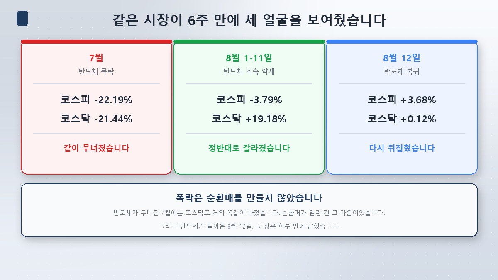
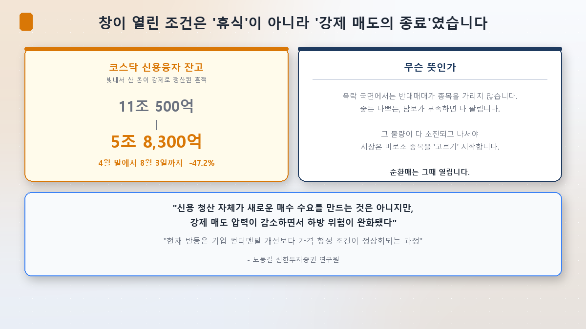
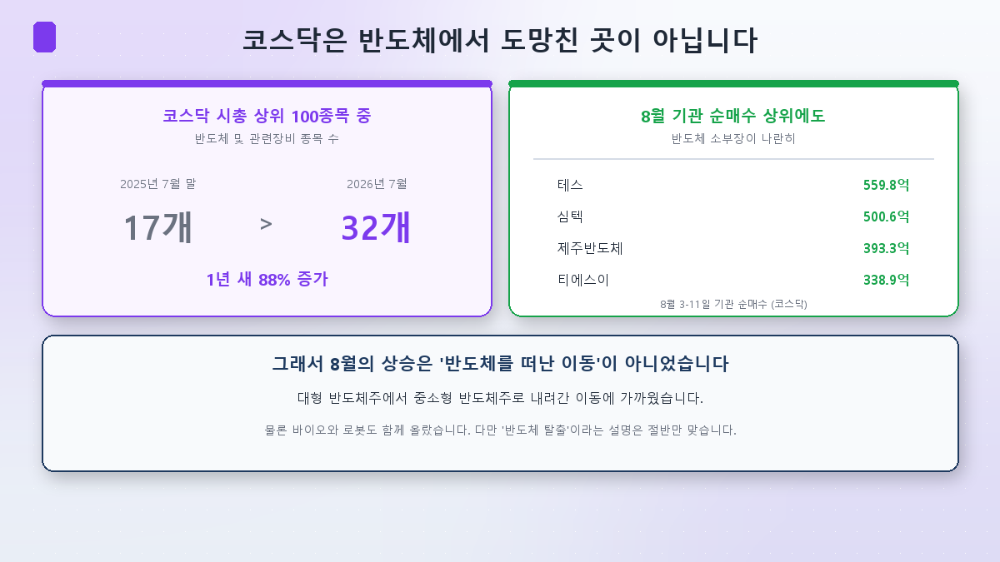
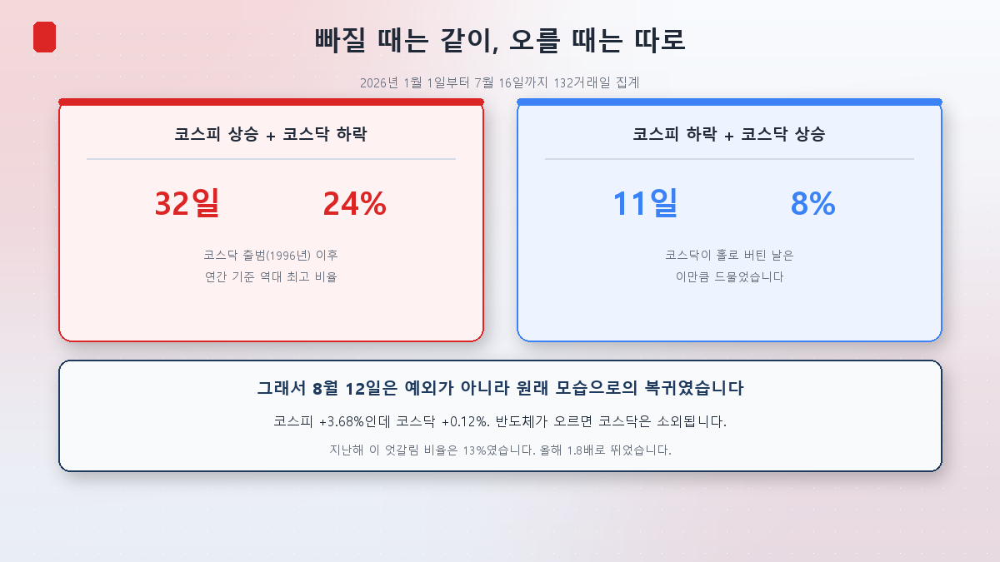
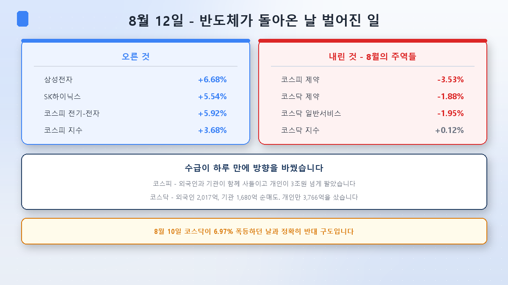

[第1篇](/zh/p/what-is-sector-rotation/)里出现过一对奇怪的数字：投资者存管金少了30%，创业板却涨了19%。不是钱变多了，而是缩水的钱挤进了更窄的地方。

那么下一个问题来了：**为什么偏偏是8月？**

7月半导体也崩了，而且崩得猛烈得多。可7月并没有出现板块轮动。把差别找出来，就会发现轮动成立的条件比看上去苛刻得多。

## 六周里的三张面孔

先把三个阶段并排放好。

| | 7月 | 8月1~11日 | 8月12日 |
|---|---|---|---|
| 半导体 | 暴跌 | 依然疲弱 | 回归 |
| 韩国综指 | **-22.19%** | -3.79% | **+3.68%** |
| 创业板 | **-21.44%** | **+19.18%** | +0.12% |

7月综指从8,476.48跌到6,595.45，创业板从916.18跌到719.76。**跌幅几乎一模一样。**

那个月的底部是这个样子：7月28日综指下跌732.09点（10.84%）那天，创业板也急跌7.72%，下跌1,480只对上涨211只。恐慌指数VKOSPI飙到83.43。7月21日创业板盘中被打到747.00，刷新52周新低；创业板市值从4月的680万亿韩元降到那天的420万亿，三个月蒸发260万亿。

**暴跌不会制造轮动。**这是市场的老脾气：急跌时个股相关性上升，没有余裕去分辨好坏，能卖的先卖。[指数第3篇](/zh/p/circuit-breaker-week/)讲过的那一周正是如此。

## 可8月半导体同样疲弱

这里我最初的假设错了。我本来的思路是「8月半导体停住了，所以别的才涨」，一核对却不是这么回事。

**8月6日，SK海力士单日下跌10.37%**，收于1,495,000韩元，盘中一度跌11.21%至1,481,000韩元。同一天三星电子也跌了6.30%。导火索是美国闪迪的业绩指引低于预期。当天外资仅SK海力士一只就净卖出1万6,936亿韩元。

按累计算更清楚。拿7月31日收盘和8月12日收盘比：

| | 7月31日 | 8月12日 | |
|---|---|---|---|
| 三星电子 | 262,500韩元 | 255,500韩元 | **-2.7%** |
| SK海力士 | 1,718,000韩元 | 1,504,000韩元 | **-12.5%** |

创业板涨19%的这段时间里，SK海力士又跌了12%以上。**半导体不是在休息，而是还在挨打。**

可创业板就在这中间涨了起来。和7月相比，究竟差在哪？

## 窗口打开的真正条件 —— 强制卖出结束了

答案在「是谁在卖」。

**创业板融资余额从4月末的11万500亿韩元降到8月3日的5万8,300亿韩元，减少47.2%。**

借钱买入的部分被清掉了一大半。这为什么重要？因为强制平仓**不挑股票**。担保比例一破，好公司坏公司一起被卖。7月创业板跌得和综指分毫不差，很大程度上就是这股强制卖压造成的。

只有这批筹码出尽，市场才会重新开始**挑选**。新韩投资证券卢东吉研究员正好点在这里：

> **「融资清算本身并不创造新的买入需求，但强制卖压减少后，下行风险缓和了。」**
>
> **「当前的反弹与其说是企业基本面改善，不如说是价格形成条件正常化的过程。」**

不是新买盘进场才涨的，而是**必须卖的人消失了**才涨的。第1篇里「钱缩水了指数却涨了」，就是这样解开的。

再叠加上[指数第4篇](/zh/p/leverage-etf-trap/)讲过的单一个股杠杆ETF监管。资金只往半导体大盘股灌的那条通道，被制度性地收窄了。这条通道关得多急，成交额说明一切。

- **KODEX SK海力士单一个股杠杆ETF成交额**：7月30日3万6,254亿韩元 → 8月10日**1,782亿韩元（-95.1%）**
- **SK海力士成交额**：6月23日历史最高21万9,000亿韩元级 → 8月10日4万7,294亿韩元（约五分之一）
- **三星电子成交额**：6月24日15万8,000亿韩元级 → 8月10日3万7,828亿韩元（约24%）

放大了7月暴跌的杠杆资金，**一个月内蒸发了95%。**三星电子与SK海力士的市值占比从7月的53.2%降到8月1日的51.16%，也有这层原因。

**所以轮动的条件不是主导股「休息」，而是强制卖出结束。**这个条件苛刻得多：暴跌得结束，清算得做完，而主导股还不能回来。是夹在中间的一扇窄窗。

## 而且创业板从来不是半导体的避难所

再往下挖一层，会冒出有意思的东西：**8月涨的创业板，真的是「非半导体」吗？**

创业板市值前100的公司里，半导体及相关设备类个股从**2025年7月底的17只增加到2026年7月的32只，一年增加88%**。

也就是说创业板本身早已相当半导体化。所以半导体一崩，创业板跟着崩。7月的同步下跌不是巧合。

看8月的领涨股也一样。8月3日至11日机构在创业板买得最多的名单里，赫然并列着Tes（559.8亿）、Simmtech（500.6亿）、济州半导体（393.3亿）、TSE（338.9亿）这些**半导体零部件设备股**。当然，LigaChem Bio、ABL Bio这类生物医药和SPG、Robotis这类机器人股也一同上涨。

所以8月的上涨，与其说是**离开半导体的移动**，不如说更接近**从大盘半导体股向中小盘半导体股往下走的移动**。「逃离半导体」这个说法，只对了一半。

## 跌的时候一起跌，涨的时候各走各的

这种不对称是有数字的。

2026年1月1日至7月16日的132个交易日中，**综指上涨而创业板下跌的日子有32天，占24%**。这是创业板1996年开市以来**按年计的历史最高比例**。去年同一比例是13%，等于跳升了1.8倍。

反过来，综指跌而创业板涨的日子只有**11天（8%）**。

IBK投资证券创业板研究中心长李建宰的说明概括了这个结构：

> **「韩国半导体零部件设备企业的技术与业绩都在改善，但由于近来综指波动加大，投资者把资金集中到了综指而不是创业板。」**

**半导体跌，创业板陪着挨打；半导体涨，创业板被晾在一边。**这才是2026年韩国市场的默认设定。8月头两周，是偏离这个默认值的例外区间。

## 而就在今天，窗口关上了

写这篇文章的今天，恰好成了那场检验。

**2026年8月12日，半导体回来了。**三星电子暴涨6.68%收于25万5,000韩元区间，SK海力士上涨5.54%收于150万韩元区间。背景是美国费城半导体指数走强与大型科技股财报。

结果是这样的：

- **韩国综指 6,579.04（+3.68%，+233.51点）** —— 电气电子板块上涨5.92%拉动了指数。
- **创业板 858.91（+0.12%，+1.07点）** —— 基本原地踏步。

而且**整个8月一直在涨的那些板块，跌了。**综指医药-3.53%，创业板医药-1.88%，创业板一般服务-1.95%。

资金流向一天之内掉头。综指这边外资与机构同时买入，个人卖出超过3万亿韩元。创业板正好相反：外资净卖出2,017亿韩元、机构净卖出1,680亿韩元，只有个人买了3,766亿韩元。

**这和[第1篇](/zh/p/what-is-sector-rotation/)里看到的8月10日恰恰相反。**那天创业板暴涨6.97%，个人却卖出6,729亿韩元。两个交易日，个人的位置就调了个个儿。这条线索留到第5篇专门讲。

大信证券李京旻研究员的收盘点评说得平实：

> **「在外资与机构同步净买入之下，展开了以大盘股为中心的强势。尤其半导体板块因大型科技股财报而投资情绪高涨，表现强劲。」**

一天的走势下不了结论。但**轮动的窗口靠什么打开、又靠什么关上**，这一天呈现得相当清晰。

## 这扇窗还会再开吗

看法有分歧。

SK证券罗承斗研究员认为结构性条件已经具备：**「当前创业板市场已开始满足过去跑赢综指时期出现过的多数条件——主导股行情之后的轮动、劣质公司退市、机器人与生物医药等下一轮主导主题。」**政策面因素也被提及：养老金基准指数纳入创业板、9月将推出的创业板溢价指数等。

也有人从技术面看。三星证券权范石研究员指出，创业板已跌到**120月移动均线（约800点）**附近，而指数仅用三个月下跌就跌破这条线，是相当罕见的情况。

另一边，卢东吉研究员给出了条件：要让涨势延续，**必须有投资信托与养老金的持续买入，并且中小盘股的盈利改善得到确认**。到目前为止只是价格条件正常化了，业绩并没有变好。

反方向同样不确定。进入8月，半导体的目标价反而被成批下调。8月11日Kiwoom证券把三星电子从39万韩元下调到35万韩元、SK海力士从220万下调到210万（维持买入评级），NH投资证券、大信证券、三星证券也分别把SK海力士目标价下调至340万、320万、300万韩元。理由大多是**2027年存储供给增加**。半导体涨了一天，并不代表预期也跟着抬高了。

补一句我的看法：上面那组不对称数字（24%对8%）大概最接近诚实的答案。**在半导体持续上涨的阶段，创业板能一起走的情况，今年很少。**而近在眼前的变量，是8月26日英伟达的财报。

## 小结

- **暴跌不会制造轮动。**7月综指-22.19%、创业板-21.44%，几乎同幅度下跌，因为强制平仓不挑股票。
- **8月半导体同样疲弱。**8月6日SK海力士单日就跌了10.37%。轮动并不是因为「主导股休息」才来的。
- **真正的条件是强制卖出结束。**创业板融资余额从4月末的11万亿降到8月初的5万亿级，减少47.2%。必须卖的筹码消失后，市场才开始挑选。
- **创业板不是半导体的避难所。**市值前100里有32只是半导体相关（一年+88%），8月机构净买入榜上也并列着半导体零部件设备股。
- **而且这扇窗很窄。**今年综指涨、创业板跌的交易日占比24%，创历史新高；半导体回归的8月12日，创业板停在+0.12%。

下一篇[第3篇]要处理这轮上涨里最需要解释的一块：**造船与国防——看起来跟AI毫无关系，为什么会涨？**是因为跟AI无关才涨，还是因为想躲开AI集中的钱流了进来？我们来掰扯一下。

> ⚠️ 本文仅为个人学习整理，不构成对任何个股或行业的买卖建议。文中的指数、资金流向与余额数据均为核对时点（2026年8月12日）的值，每日都在变化。另请留意，单日走势很难作为趋势的证据。投资决策及其后果由本人承担。
