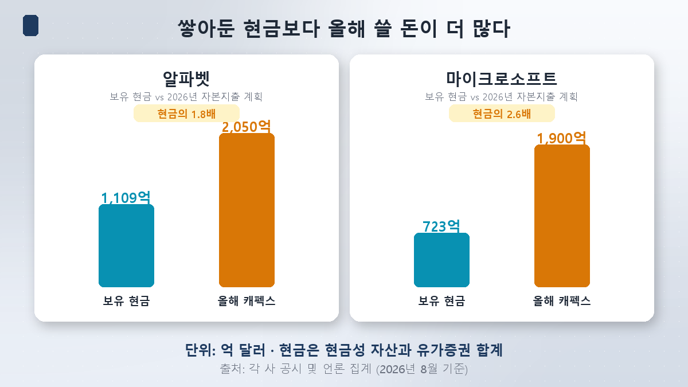
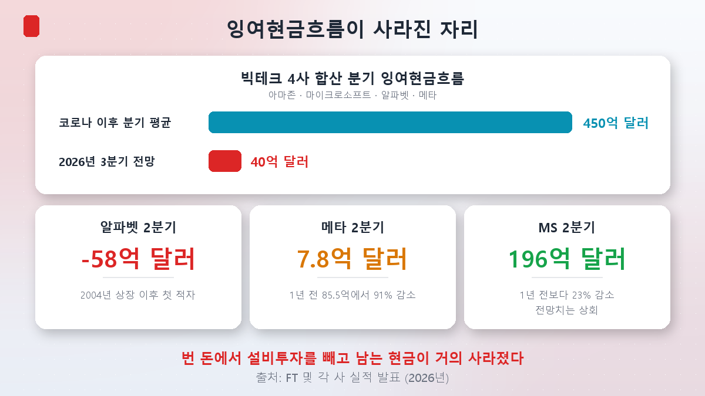
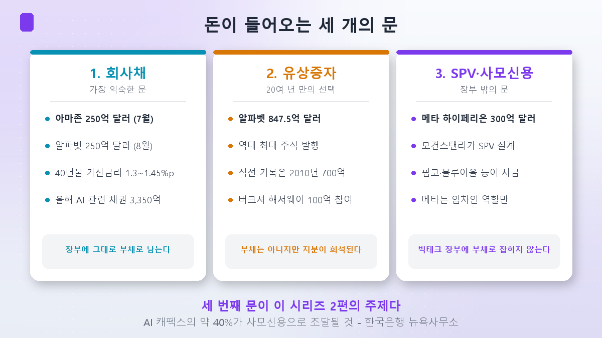
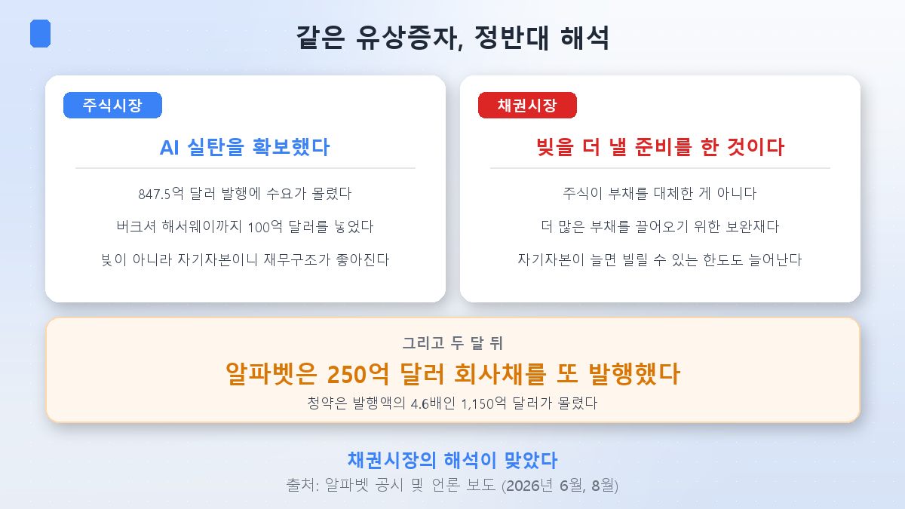

A new series starts here.

While writing [part 4 of the rotation series](/en/p/is-bio-a-rate-play/), I ran into a number that wouldn't leave me alone: **AI companies' share of the US investment-grade corporate bond market had gone from 2.4% to 16.4%.** That post was about biotech, and the figure passed by as a footnote.

But it kept nagging. Why did the richest companies in the world suddenly become the biggest borrowers in the bond market?

## Earning $300k, holding $500k — and taking a $1M loan

Imagine someone earning 300,000 a year with 500,000 in the bank. If they borrow a million, most people react the same way:

> "They've got money. Why borrow?"

But if the house costs **two million**, the question changes. They didn't borrow because they had money. They borrowed because they **didn't have enough**. Against two million, both the income and the savings fall short.

Big Tech is in exactly that position. And that gives this series its first conclusion: **the question "why is cash-rich Big Tech borrowing?" is already out of date.**

## This year's spending plan is bigger than the bank account

Let's confirm the conventional wisdom first. Big Tech really is cash-rich.

- **Alphabet** — about **$110.9 billion** in cash and securities
- **Microsoft** — about **$72.3 billion**
- **Apple** — about **$162 billion**

Add Apple and the four largest holders come to roughly $377 billion. An enormous pile of money.

Now here is what they said they would **spend this year**.

| Company | 2026 capex plan | vs. cash on hand |
|---|---|---|
| Amazon | ~$200–220 billion | — |
| Alphabet | $195–205 billion | about **1.8x** its cash |
| Microsoft | ~$190 billion | about **2.6x** its cash |
| Meta | $130–145 billion | — |
| **Four combined** | **$725–760 billion** | up **~77%** from $410 billion last year |

**Capital expenditure (capex)** is money spent on assets that will be used for years — data center buildings, servers, chips, power equipment. Unlike advertising, it isn't expensed away in the year it's spent; it stays on the books as an asset. That makes a capex plan closer to **an advance purchase order** than a budget line.

Alphabet plans to spend nearly twice what sits in its accounts. Microsoft, more than two and a half times. Emptying the vault wouldn't cover it.

## Free cash flow disappeared

"But they earn money every year," you might say. True. Which is why the number to watch is **free cash flow (FCF)**.

> **Free cash flow = cash generated from operations − capital expenditure**
> What the company can actually do as it pleases with. The source of dividends, buybacks, and acquisitions.

That number collapsed this year.

**Meta's second quarter** makes the mechanics vivid. It generated **$31.86 billion** from operations and put **$31.08 billion** of it into capex. What remained was **$784 million** — down **91%** from $8.55 billion a year earlier.

**Alphabet's second quarter** was more dramatic still: free cash flow of **negative $5.8 billion**, its **first deficit since going public in 2004**. Google isn't failing to make money. It simply spent more than it made.

**Microsoft** fared better, keeping $19.6 billion. Still 23% below a year ago — but it beat the consensus estimate of $13.44 billion, and the stock jumped on results day. We are in a market where **"free cash flow was less bad than feared" counts as good news.**

Citing Wall Street estimates, the Financial Times reported that **combined free cash flow at Amazon, Microsoft, Alphabet and Meta would come to roughly $4 billion in the third quarter**. Their post-pandemic quarterly average was **$45 billion**. Nine-tenths of it, gone. Amazon is expected to be net cash-negative by about $10 billion for the full year.

So: **the bank balance isn't enough, and this year's earnings aren't enough either.** That leaves one option.

## Three doors the money comes through

### Door one — corporate bonds

A **corporate bond** is an IOU issued by a company. It borrows from investors, pays a fixed coupon, and repays the principal at maturity.

- **Amazon** — $25 billion in July, across eight maturities. Orders reached as much as **$62 billion**.
- **Alphabet** — $25 billion in August, ten tranches from two-year to 40-year. The book reached **$115 billion**, **4.6 times** the deal size.

This is where **spread** enters. It's how much extra yield a borrower pays over a government bond of the same maturity — compensation for the fact that a company is riskier than a state. Alphabet's 40-year notes were discussed around **130 basis points** over Treasuries; Amazon's, around **145**.

As of early July, **global AI-related bond issuance for the year had reached $335 billion** — more than double all of last year.

### Door two — equity

If you dislike debt, sell new shares. Alphabet did exactly that in June.

The offering came to **$84.75 billion**, raised from an initial $80 billion after demand poured in. Of that, $75 billion went out as common and convertible stock, and **$10 billion was placed privately with Berkshire Hathaway**.

The scale only lands with a comparison. The previous record for the largest share sale in history was **Petrobras's $70 billion in 2010**. That mark stood for fifteen years and was cleared comfortably.

### Door three — off the balance sheet

The least familiar door, and the most important one.

For its **Hyperion data center** in Louisiana, Meta arranged **$30 billion**. But Meta didn't borrow it. Morgan Stanley set up a **special purpose vehicle (SPV)** that raised $27 billion in debt and $2.5 billion in equity, funded by institutions including Blue Owl Capital and PIMCO.

Meta's role is developer and **tenant**. The data center gets built — and **the debt never appears on Meta's balance sheet.**

The Bank of Korea's New York office estimates that **roughly 40% of Big Tech's AI capex this year will be funded through private credit**. That third door is the subject of **part 2**.

## The bond market didn't welcome the equity raise

Here's the most interesting turn in this episode.

An equity offering is normally **good news** for bondholders. The company is funding itself with its own money instead of debt, and a thicker equity cushion means less chance of default. This time, the reaction was different.

The bond market read Alphabet's $84.75 billion raise as **a signal that more borrowing was coming**. Equity wasn't **replacing** debt; it was a **complement** that made room for more of it. A bigger equity base means a bigger debt capacity.

The Bank for International Settlements also warned that US Big Tech was piling into debt. One headline captured the temperature gap neatly: **stocks cheered, bonds shrugged.**

Two months later, Alphabet issued **another $25 billion of bonds** — on top of the more than $50 billion it had already raised in the US, Europe and Japan during the first half.

This time, the bond market read it right.

## And yet nobody is frightened

Read only this far and it sounds like an alarm. But **the case for the other side is solid too**, and this series is not a warning notice.

- **The market isn't treating it as a problem.** Spreads on the highest-rated corporate credits fell as low as **74 basis points** over Treasuries this summer, the tightest since the late 1990s. Alphabet's book at 4.6x cover and Amazon's at 2.5x say the same thing: **lenders are queuing up.**
- **These remain top-tier credits.** Alphabet, Amazon, Meta and Microsoft have exceptional cash generation and balance sheets, and the prevailing view is that near-term ratings damage is unlikely.
- **The borrowed money becomes an asset, not a hole.** Data centers and servers are physical. This is not 1999, when dot-coms borrowed without revenue. That comparison gets its own treatment in **part 4**.

One caveat, though. **The argument only holds if the data centers earn their keep.** As covered in the [semiconductor side piece](/en/p/money-river-check/), the payback on AI capex is still in progress.

## Why this matters from Korea

Three channels.

**First, that $725 billion is an order book.** Roughly 60% of Alphabet's capex goes into servers, and memory and GPUs sit inside that. The HBM demand traced in the [semiconductor series](/en/p/what-is-hbm/) originates here. That Big Tech will borrow to keep investing also means the orders hold, at least for now.

**Second, this money touches interest rates.** When AI companies absorb capital in the bond market, less is left for government bonds and yields rise — the **"reverse crowding out"** met in part 4 of the rotation series. Whether it is really the main driver is another matter. **Part 3** will test that hypothesis from the skeptical side.

**Third, US long rates arrive intact in Korea's bond market and KOSDAQ valuations.** In August the 30-year Korean treasury hit a record 4.751%, and the KOSPI fell 5.8% and rose 5.9% within days — rates, again. That was the tape described in [part 6 of the rotation series](/en/p/how-to-read-rotation/). **Part 5** follows that path.

## Summary

- **The question was wrong.** Big Tech borrows because it is **short**, not flush. Alphabet holds $110.9 billion in cash against a capex plan of up to $205 billion.
- **Free cash flow collapsed.** Alphabet's Q2 FCF was its **first deficit since the 2004 IPO (−$5.8 billion)**; Meta's fell **91%**. The four combined are seen at about $4 billion in Q3, a tenth of their $45 billion post-pandemic quarterly average.
- **Money arrives through three doors.** Bonds ($25 billion each from Amazon and Alphabet), equity (Alphabet's $84.75 billion, the largest share sale on record), and **off-balance-sheet SPVs and private credit** (Meta's $30 billion Hyperion). The third is expected to carry about 40% of capex.
- **The bond market didn't take the equity raise as good news.** It called it a complement to debt rather than a substitute — and two months later Alphabet issued more bonds, proving the point.
- **Still, this is not an alarm.** Investment-grade spreads are at their tightest since the late 1990s and every deal draws multiples of demand. The market is not yet pricing this debt as a risk.

Next time: **the data centers being built off the balance sheet.** How $30 billion stops being Meta's debt — and whether that structure hides risk or is simply how infrastructure has always been financed.

> ⚠️ This post is a personal study note and not a recommendation regarding any security or strategy. Financial figures and issuance sizes reflect disclosures and press reports as of the date checked (24 August 2026); capex plans are company guidance and change frequently. Aggregates differ by data provider, so ranges are used. Investment decisions and their consequences are your own.
