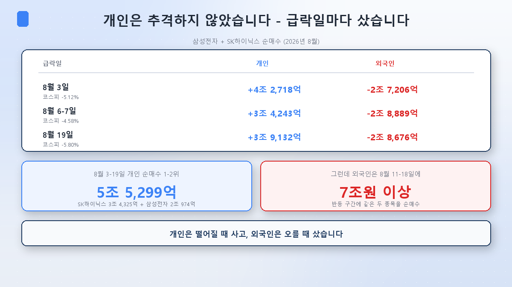
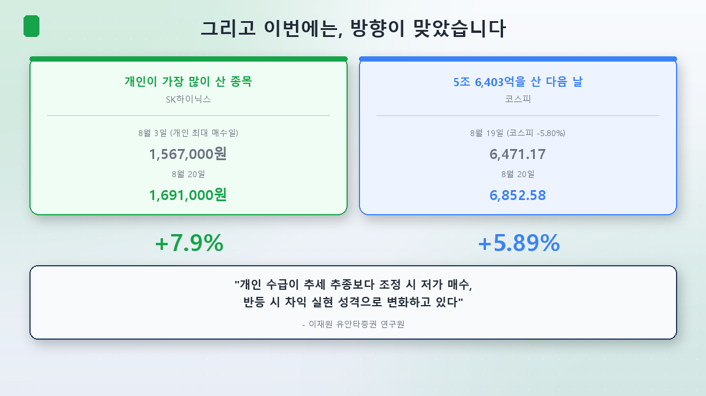
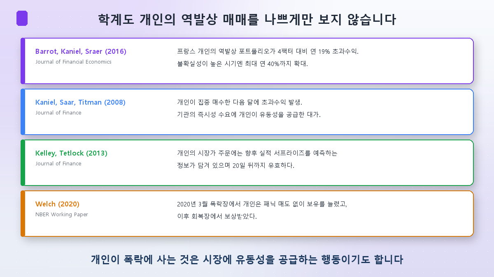
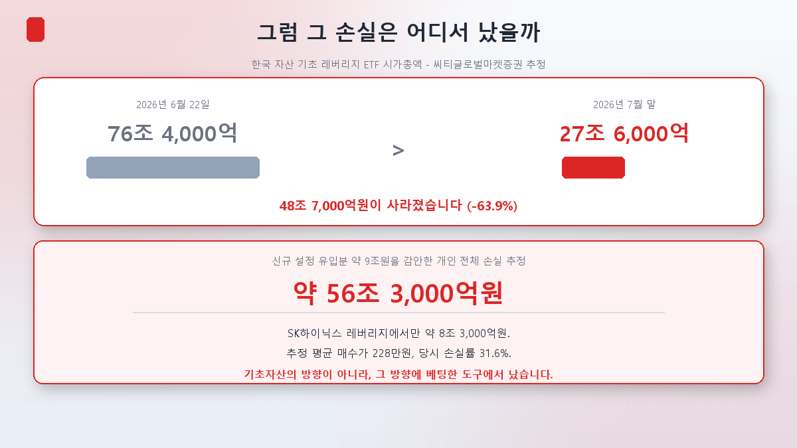
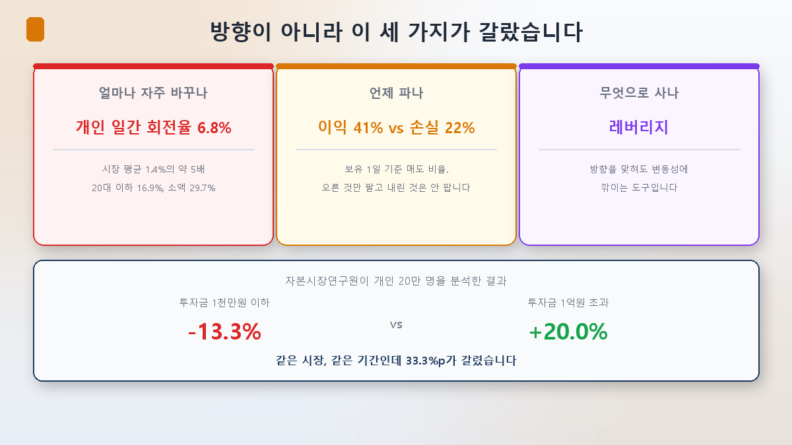

Time for the thread I've been deferring all series. From [Episode 1](/en/p/what-is-sector-rotation/) through [Episode 4](/en/p/is-bio-a-rate-play/), the same sentence kept appearing whenever I checked the dates.

> On August 10, as the KOSDAQ surged 6.97%, individuals sold 672.9 billion won.
> On August 19, as the KOSPI collapsed 5.80%, individuals bought 5.64 trillion won.

Stop there and the conclusion writes itself: retail got caught on the wrong side again. But open the numbers further and **the conclusion I was about to write turns out to be wrong.**

## First: retail wasn't chasing

The conventional story goes like this. Retail sees what has already risen, buys late off the news, and ends up buying tops and selling bottoms.

**In August 2026, Korean retail did exactly the opposite.**

| Crash day | Retail (Samsung + SK Hynix) | Foreigners |
|---|---|---|
| August 3 (KOSPI -5.12%) | **+4.27tn won** | -2.72tn won |
| August 6–7 (KOSPI -4.58%) | **+3.42tn won** | -2.89tn won |
| August 19 (KOSPI -5.80%) | **+3.91tn won** | -2.87tn won |

Between August 3 and 19, retail's two largest net purchases were SK Hynix (3.43tn won) and Samsung Electronics (2.10tn won) — **5.53 trillion won combined.** And all of it went in on **falling days.**

Foreigners did the mirror image: selling into every crash and buying more than **7 trillion won** of those same two stocks during the August 11–18 rebound.

**Retail bought weakness; foreigners bought strength.** That's contrarian behaviour, not chasing.

## And this time, the direction was right

Which raises an uncomfortable question: did retail actually lose money?

- **SK Hynix**: closed at 1,567,000 won on August 3 — the day retail poured in over 2 trillion won — and at 1,691,000 won on August 20. **+7.9%.**
- **KOSPI**: closed at 6,471.17 on August 19, the day retail bought 5.64 trillion won net, and at 6,852.58 the next day. **+5.89%.**

**What retail bought went up.** Within a day.

Lee Jae-won of Yuanta Securities describes the shift precisely:

> **"Retail flows are shifting from trend-following toward buying dips during corrections and taking profits on rebounds."**

Retail that used to chase trends is turning contrarian. From August 19 to 21, three straight sessions saw retail buying while foreigners and institutions sold — and over those three days the KOSPI went from 6,471 to 6,912.

## Academia doesn't dismiss this either

"Retail is always wrong" gets used like common sense. The research is far less certain.

- **Barrot, Kaniel, Sraer (2016, Journal of Financial Economics)** — French retail investors' contrarian portfolio earned **19% a year** in excess of a four-factor model, rising to as much as 40% in high-uncertainty periods. During the 2008 crisis, retail actually increased holdings and supplied liquidity.
- **Kaniel, Saar, Titman (2008, Journal of Finance)** — Stocks retail bought heavily earned excess returns the following month, interpreted as compensation for supplying liquidity when institutions needed immediacy.
- **Kelley, Tetlock (2013, Journal of Finance)** — Retail market orders contained information predicting future earnings surprises, and stayed predictive out to 20 days.
- **Welch (2020, NBER)** — In the March 2020 crash, Robinhood investors didn't panic-sell; they added, and were rewarded in the recovery.

**Retail buying a crash is also an act of supplying liquidity.** When foreigners dumped 4 trillion won on August 19, retail took the other side. Somebody has to, or the market stops working.

## So where did the 56 trillion go?

And yet that figure from [Index Episode 4](/en/p/leverage-etf-trap/) is still sitting there: Citi's late-July estimate of roughly **56 trillion won** in retail losses.

If the direction was right, how? The answer is in **where** the money was lost.

What Citi measured wasn't individual stocks. It was the **market capitalisation of leveraged ETFs**.

- June 22, 2026: **76.4 trillion won**
- End of July 2026: **27.6 trillion won**
- Gone: **48.7 trillion won (-63.9%)**

Adjusting for roughly 9 trillion won of new creations over the period gives the estimated retail loss of about **56.3 trillion won.** SK Hynix leverage products alone accounted for around 8.3 trillion, at an estimated average purchase price of 2.28 million won and a 31.6% loss at the time.

**The loss came from the instrument, not the underlying.** SK Hynix the stock rebounded in August; a daily-rebalanced leveraged ETF cannot track that, because of the volatility decay I calculated in [Index Episode 4](/en/p/leverage-etf-trap/). Same direction, different outcome — by construction.

Inverse products are worse. KODEX 200 Futures Inverse 2X had returned **-95.86%** over one year as of June, and -90.75% over six months.

## What actually separated winners from losers

If not direction, then what? The research keeps pointing at the same three things.

**① How often you switch — turnover**

The Korea Capital Market Institute analysed 200,000 retail accounts and found **daily turnover of 6.8%** — about five times the market average of 1.4%. For under-30s it was 16.9%; for small accounts, 29.7%.

Barber and Odean's classic study (2000) reached the same place. Across 66,000 US households, the average household earned 16.4% a year against a market at 17.9% — but **the most active quintile earned 11.4%**, trailing the market by 6.5 percentage points.

**② When you sell — the disposition effect**

Selling winners early and holding losers. Named by Shefrin and Statman in 1985; Odean (1998) showed investors sell winning positions **1.5 to 2 times** more readily than losing ones.

Korea is no different. In the KCMI data, at a one-day holding horizon the **sell rate was 41% for winning positions and 22% for losing ones.** And decisively: **investors with a strong disposition effect earned 0.73–1.07% over ten days, against 1.71% for those without it.** It's a correlation, but the direction is clear — selling early costs you.

August retail did exactly this. They bought the crash and **sold the rebound**: net sales of 3.19tn and 2.74tn won on August 12–13, and another 2.65tn won on the August 20 rebound. The direction was right and the gain went uncollected.

**③ What you buy with — the instrument**

The leverage problem above. Barber, Lee, Liu and Odean (2009), working with every trade in the Taiwanese market, found retail losses of 3.8 percentage points a year — equal to 2.2% of Taiwan's GDP. Crucially, **most of that loss came from aggressive market orders, while patient limit orders were actually profitable.**

The same investor, buying differently, got a different result.

## And the widest gap of all

This is the number from the KCMI data I stared at longest.

| Account size | Excess return vs market |
|---|---|
| Under 10 million won | **-13.3%** |
| Over 100 million won | **+20.0%** |

**Same market, same period, 33.3 percentage points apart.** The overall retail average was -2.0%, new investors -17.6%, and 60% of new investors — 42% of all — lost money.

Read that alongside the fact that small accounts had the highest turnover at 29.7% and the picture sharpens. **The smaller the start, the more often people switched — and the more they switched, the more they lost.**

## Summary

- **Retail wasn't chasing.** Between August 3 and 19, its two biggest net buys were SK Hynix and Samsung Electronics, 5.53 trillion won in total — all of it on crash days. Foreigners did the reverse.
- **And the direction was right.** SK Hynix rose 7.9% from August 3 to 20; the KOSPI rose 5.89% the day after retail bought 5.64 trillion won.
- **Academia doesn't dismiss retail contrarianism.** French data showed a 19% annual excess return, and retail supplying liquidity during crises is documented.
- **The 56 trillion came from the instrument, not the direction.** Leveraged ETF market cap fell from 76.4tn to 27.6tn won. The underlying recovered; the product didn't.
- **Turnover, disposition and instrument decided it.** Retail turnover runs five times the market's, winners are sold at twice the rate of losers, and accounts under 10 million won returned -13.3% against +20.0% for those over 100 million.

So "retail was wrong" isn't accurate. **Retail wasn't wrong so much as short.** The direction was often right; the holding period was brief, and the instrument ate the direction.

[Episode 6] closes the series: **how to read a rotation — the indicators that let you notice one instead of chasing it.** I'll turn what these five episodes found into things you can actually check.

> ⚠️ This post organizes what I've studied and is not a recommendation of any stock or trading approach. Flow, return and research figures are as of when I checked (August 22, 2026); the KCMI study in particular is based on 2020 data and may not describe the present. Citi's 56 trillion won figure is a late-July estimate that has not been updated. A few days of trading results cannot settle who was right. Investment decisions and their consequences are your own.
