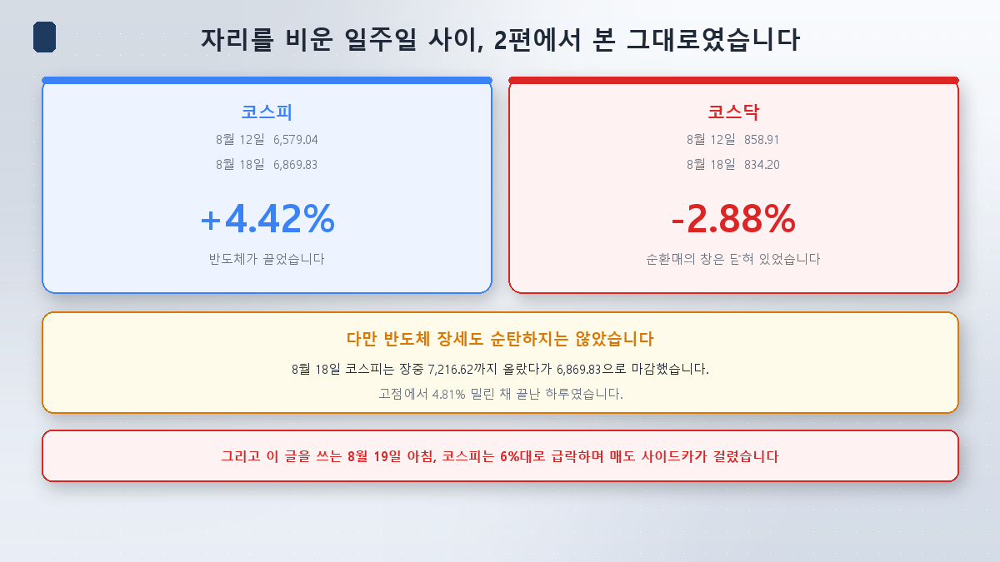
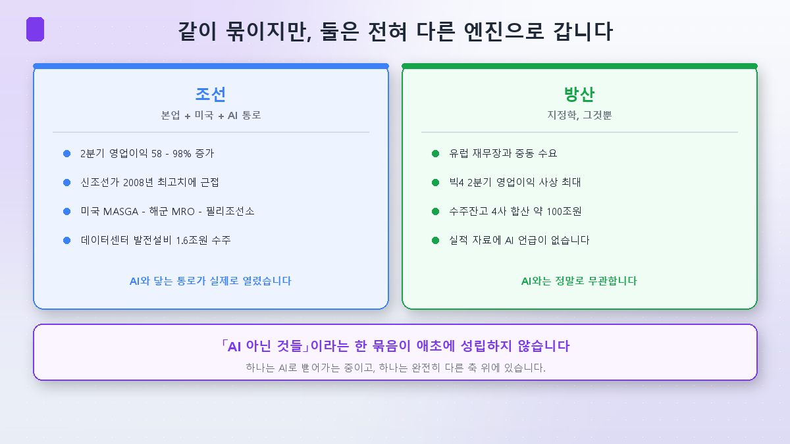
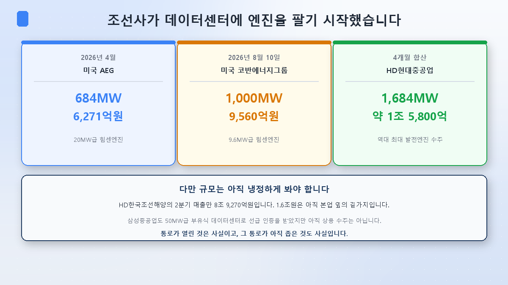
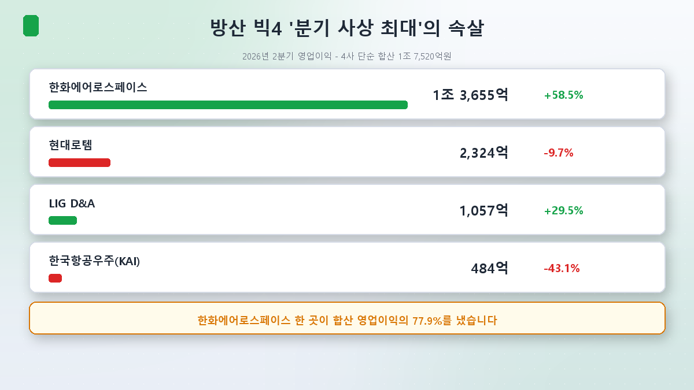
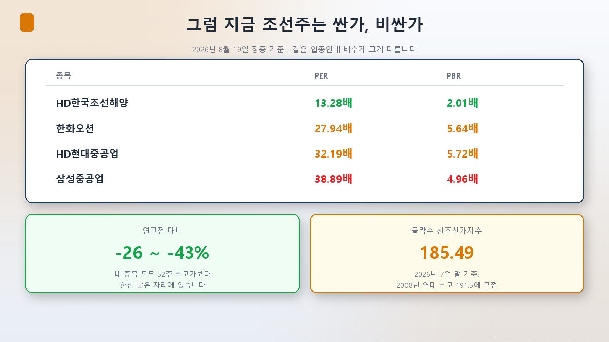

隔了一周。去平昌休假，所以这篇晚了几天。本想在山里不看指数，结果每天晚上还是打开了盘口。

回来一核对，[第2篇](/zh/p/when-the-leader-rests/)指出的那个格局几乎原样重现。

## 我不在的这一周

8月12日还是6,579.04的韩国综指，8月18日收在6,869.83，**+4.42%**。同期创业板从858.91跌到834.20，**-2.88%**。

按日看更清楚。创业板并没有绝对崩塌：8月13日涨0.29%，14日涨0.38%。可同一天综指涨了3.56%和2.42%。**涨是涨了，却被远远甩开**——正是第2篇里那种不对称。然后8月18日，创业板重挫3.52%。

拉动指数的又是半导体。8月14日外资单日净买入3万483亿韩元，综指重回7,000点。

不过半导体行情也谈不上顺利。**8月18日综指盘中一度触及7,216.62，收在6,869.83**——从当天高点回落4.81%收场。

而就在我写这篇的**今天（8月19日）早上，综指暴跌逾6%，9点06分触发卖方熔断保护（sidecar），这是今年第48次。**美国30年期国债收益率跃上5.33%，费城半导体指数下跌4.98%。三星电子与SK海力士上午双双急跌7~8%。（盘还没收，收盘数字我还不知道。）

我休假这几天，市场就这么折腾了一轮。好，进入今天的正题。

## 「造船和国防是下一批主导股」——真的吗

7月以来韩国券商反复出现一句话：**「过度集中于半导体的市场将会分散」**（LS证券廉承焕理事，7月2日），并把造船、国防、电力设备列为下一批主导行业。

这句话里藏着一个前提：造船和国防同属**「非AI的那些东西」**这一个筐——是嫌AI太挤的钱的避难所。

我起初也是这么切入的。可打开一看，这个筐本身就不成立。

## 造船 —— 通往AI的通道真的打开了

先看造船股上涨的理由。第一条很简单：**业绩是真的变好了。**

| 2026年第二季度 | 营收 | 营业利润 | |
|---|---|---|---|
| HD韩国造船海洋 | 8万9,270亿韩元（+20.2%） | **1万6,451亿韩元** | **+72.5%** |
| 韩华海洋 | 5万4,432亿韩元（+65.2%） | **7,361亿韩元** | **+98.0%** |
| 三星重工业 | 3万2,307亿韩元（+20.4%） | 3,250亿韩元 | +58.7% |

三家都创下季度最高或接近最高的业绩。这不是扭亏为盈，而是**本就盈利的部分大幅膨胀**。克拉克森新船价格指数7月末为185.49点，逼近2008年超级周期时的历史最高（191.5点上下）。

第二条是美国。7月23日，**韩美造船合作中心（KUSPC）**在华盛顿揭牌，这是「3,500亿美元对美投资中拿出1,500亿美元（约200万亿韩元）用于造船合作」这一共识的后续动作。美国海军舰艇MRO（维修保养）订单方面，HD现代重工业与韩华海洋今年都已超过去年全年；韩华收购费城造船厂后，50亿美元投资计划已执行2亿美元。

**而第三条，是这一篇里最让我意外的部分。**

HD现代重工业**正在向美国的数据中心卖发电设备。**

- **2026年4月** —— 向美国AEG供应20MW级HiMSEN发动机发电设备 **684MW，6,271亿韩元**
- **2026年8月10日** —— 向美国Coban能源集团供应9.6MW级HiMSEN发电设备 **1,000MW，9,560亿韩元**，用作当地大型科技公司数据中心的电力来源。这是该公司史上最大规模的发电用发动机合同。

四个月合计**1,684MW、约1万5,800亿韩元**。三星重工业也在4月为50MW级**浮式数据中心**取得了美英船级社的原理认可（AiP）。

造船的公司开始向数据中心卖发动机。我在[电力教科书第1篇](/zh/p/ai-power-hunger/)里写过「AI真正的瓶颈是电」，如今这个瓶颈一路顶到了造船厂。

**不过规模要冷静看。**HD韩国造船海洋一个季度的营收就是8万9,270亿韩元。1万5,800亿还只是主干旁边的枝条；三星重工业的浮式数据中心也还停在认证阶段，不是商业订单。

**通道打开了是事实，通道仍然狭窄也是事实。**造船股行情的主体，依旧是主业（船价、订单、业绩）和美国。Daol投资证券崔光植研究员把MASGA与AI数据中心称作「突破造船股见顶担忧的两个变量」，说的也是*未来的变量*，而不是*当下的动力*。

## 国防 —— 这一边是真的与AI无关

国防完全是另一个故事。

2026年二季度，韩国国防四巨头营业利润简单合计**1万7,520亿韩元**，创季度历史新高，并连续五个季度超过1万亿。四家合计订单储备约100万亿韩元。

动力来自地缘政治。德国2026年国防预算增至1,080亿欧元（约188万亿韩元），同比增长25%；北约已就2035年前把GDP的5%投入安全达成一致。韩华航空航天2月在罗马尼亚为K9生产设施动工，2027年起本地化生产；现代Rotem正在谈判波兰K2坦克第三批履约合同（210辆）。

**这些材料里，一个「AI」字都没有。**也不存在造船那样通往数据中心的通道。国防与其说与AI无关，不如说**它本来就站在另一块地上。**

今天早上把这点演得明明白白。综指暴跌6%的当口，**唯独韩华航空航天上涨7.42%**——因为它被选为美国陆军下一代自行火炮（K9轮式版）样机的独家制造商。样机6门加12门选择权，规模最高2亿3,300万美元（约3,200亿韩元）；若通过性能测试，后续合同规模会大得多。**不管指数塌不塌，国防按国防的题材走。**

### 但把「历史新高」打开看看

按这个系列的老习惯，再往下一层。那1万7,520亿韩元是这么构成的。

| | 二季度营业利润 | 同比 |
|---|---|---|
| 韩华航空航天 | **1万3,655亿韩元** | +58.5% |
| 现代Rotem | 2,324亿韩元 | **-9.7%** |
| LIG D&A | 1,057亿韩元 | +29.5% |
| 韩国航空宇宙（KAI） | 484亿韩元 | **-43.1%** |

**韩华航空航天一家就贡献了合计营业利润的77.9%。**而四家里有两家的营业利润反而下降了。

「K-国防创历史新高」这个标题是真的，但真正在赚钱的地方很窄。这正是[指数第2篇](/zh/p/index-concentration-trap/)里那种综指集中，在一个行业内部又重演了一遍。买国防ETF，就等于把这份分化整个抱回家。

## 那现在能买吗

这篇不做推荐，所以只把坐标摆出来。

同属造船行业，倍数却差得很远。HD韩国造船海洋是PER 13.28倍、PBR 2.01倍，三星重工业却是PER 38.89倍、PBR 4.96倍。**很难用「造船股」一个词把它们装在一起。**

而且四只都处在**比52周高点低26~43%**的位置。国防也类似：韩华航空航天在8月初时较年内高点下跌了40.3%。

这有两种读法，和[指数第6篇](/zh/p/reading-index-ai-era/)里那个问题一样：业绩变好而股价下跌，究竟是变便宜了，还是市场不信后面的业绩。券商也分裂。iM证券把韩华航空航天目标价从183万韩元下调到149万韩元，同时又说**「相对基本面的估值处在前所未有的吸引区间」**（边容振研究员）；KB证券则从175万下调到140万，降幅20%。造船这边，Kiwoom证券、新韩投资证券、元大证券也接连下调了目标价。

**业绩在变好，目标价却在下调。**被削的不是盈利，而是倍数——这和指数第6篇里半导体的处境，是完全相同的语法。

## 小结

- **「造船·国防」这个筐本来就不成立。**它们总被一起点名为轮动受益股，可两者靠不同的引擎在跑。
- **造船确实打通了通往AI的通道。**HD现代重工业四个月内拿下1万5,800亿韩元的数据中心发电设备订单。不过相对于季度8万亿级的主业营收，这仍是枝条。
- **造船行情的主体是主业和美国。**二季度营业利润增长58~98%，新船价格逼近2008年高点，MASGA、海军MRO、费城造船厂打开了新市场。
- **国防是真的与AI无关。**欧洲再武装与中东需求就是全部——今早综指跌6%时韩华航空航天涨7.42%，就是证据。
- **看看「历史新高」里面的分化。**四巨头合计营业利润的77.9%出自韩华航空航天一家，另有两家利润下滑。

所以「嫌AI太挤的钱转向造船和国防」这个说法，只对了一半。**一个正朝AI延伸，另一个从一开始就站在别的土地上。**既然买入的理由不同，等半导体再跑起来时，两者的命运也不会相同。

下一篇[第4篇]看这个8月最热的那一块：**生物医药与创业板——利率和流动性的函数。**当决定股价的不是业绩而是利率，这样的行业究竟不同在哪里。

> ⚠️ 本文仅为个人学习整理，不构成对任何个股或行业的买卖建议。文中的股价、资金流向与估值数据均为核对时点（2026年8月19日）的值，其中8月19日的数字为盘中值，可能与收盘不同。提及个股仅为说明原理。投资决策及其后果由本人承担。
